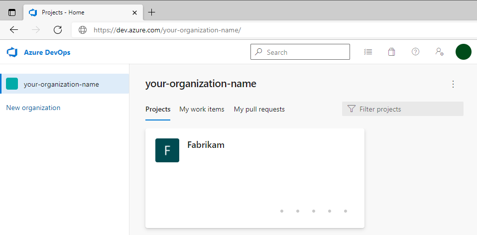

## Before the hands-on lab

Duration: 60 minutes

You should follow all of the steps provided in this section _before_ taking part in the hands-on lab ahead of time.

### Task 1: Create the Project Repo

In this task, you will create an account in [GitHub](https://github.com) and use `git` to add lab files to a new repository.

1. In a new browser tab open ```https://www.github.com``` and Log in with your personal GitHub account.

    > **Note** : You have to use your own GitHub account. If you don't have a GitHub account then navigate to the following link ```https://github.com/join ``` and create one.
    
1. In the upper-right corner, expand the user drop down menu and select **Your repositories**.

   

1. Next to the search criteria, locate and select the **New** button.

   

1. On the **Create a new repository** screen, name the repository ```mcw-continuous-delivery-lab-files``` and select the **Create repository** button.

   

1. On the **Quick setup** screen, copy the **HTTPS** GitHub URL for your new repository, paste this in notepad for future use.

   

2. In your Labvm open a Powershell Terminal and run the below commands to clone the lab repository.

   - Create an appropriate workspace folder and navigate to it in a PowerShell terminal.

     ```pwsh
     C:
     mkdir C:\Workspaces
     cd C:\Workspaces
     mkdir lab
     cd lab
     ```

   - Type the following command and press `<ENTER>`:

     ```pwsh
     git clone https://github.com/microsoft/MCW-Continuous-delivery-in-Azure-DevOps.git
     ```

   - Create a folder for the GitHub repository created in Step 1 and navigate to it in PowerShell.

     ```pwsh
     mkdir mcw-continuous-delivery-lab-files
     cd mcw-continuous-delivery-lab-files
     ```

   - Copy lab files from the MCW lab repository to the new folder.

     ```pwsh
     Copy-Item '..\mcw-continuous-delivery-in-azure-devops\Hands-on lab\lab-files\*' -Destination ./ -Recurse
     ```

   - Initialize folder as a git repository, commit, and submit contents to remote GitHub branch `main` in the lab files repository created in Step 1. Make sure to replace `<your_github_repository-url>` with the value you copied in step 5

     > **Note**: The URI of the lab files GitHub repository created in Step 1 will differ from that in the example below.

     ```pwsh
     git init
     git add .
     git commit -m "Initial commit"
     git branch -M main
     git remote add origin <your_github_repository-url>
     git push -u origin main
     ```

### Task 2: Create GitHub Personal Access Token

1. Log in to your GitHub account.

2. Create a Personal Access Token as [described here](https://docs.github.com/en/free-pro-team@latest/github/authenticating-to-github/creating-a-personal-access-token).  Ensure the following scopes are checked when configuring your GitHub Personal Access Token:

    - `repo` - Full control of private repositories
    - `workflow` - Update GitHub Action workflows
    - `write:packages` - Upload packages to GitHub Package Registry
    - `delete:packages` - Delete packages from GitHub Package Registry
    - `read:org` - Read org and team membership, read org projects

    

3. Copy the GitHub Personal Access Token somewhere safe and accessible for later use during the lab. **DO NOT COMMIT THIS VALUE TO YOUR REPO!**

    

### Task 3: Create Azure DevOps Personal Access Token

1. Log in to your existing Azure DevOps account or create a new account on https://dev.azure.com.

    

2. Create an Azure DevOps Personal Access Token as [described here](https://docs.microsoft.com/en-us/azure/devops/organizations/accounts/use-personal-access-tokens-to-authenticate?view=azure-devops&tabs=preview-page).  For this lab, please ensure your Azure DevOps Personal Access Token is configured with a `Full access` scope.

    > **Note**: A `Full access` scope is not recommended for Azure DevOps Personal Access Tokens in live development and production environments. We are only using this scope for this lab.

    

3. Copy the Azure DevOps Personal Access Token somewhere safe and accessible to you for later use during the lab. **DO NOT COMMIT THIS VALUE TO YOUR REPO!**

    

### Task  4: Create Azure DevOps Project

1. Create a `Fabrikam` project in Azure DevOps for use in the lab.

2. (Optional) To complete Exercise 3: Task 3 in the Hands on Lab, the student will need to request a free grant of parallel jobs in Azure Pipelines via [this form](https://aka.ms/azpipelines-parallelism-request). More information can be found [here regarding changes in Azure Pipelines Grant for Public Projects](https://devblogs.microsoft.com/devops/change-in-azure-pipelines-grant-for-public-projects/).

You should follow all steps provided *before* performing the Hands-on lab.
