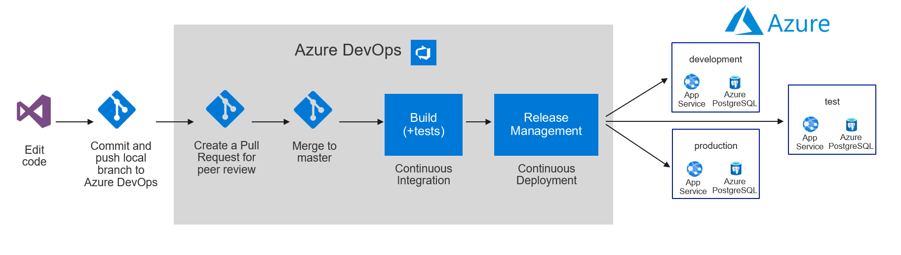
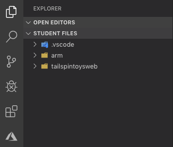
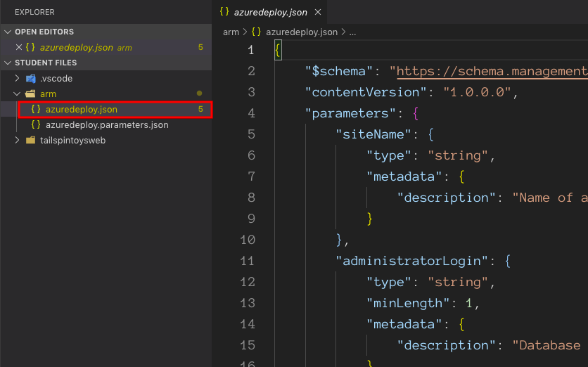
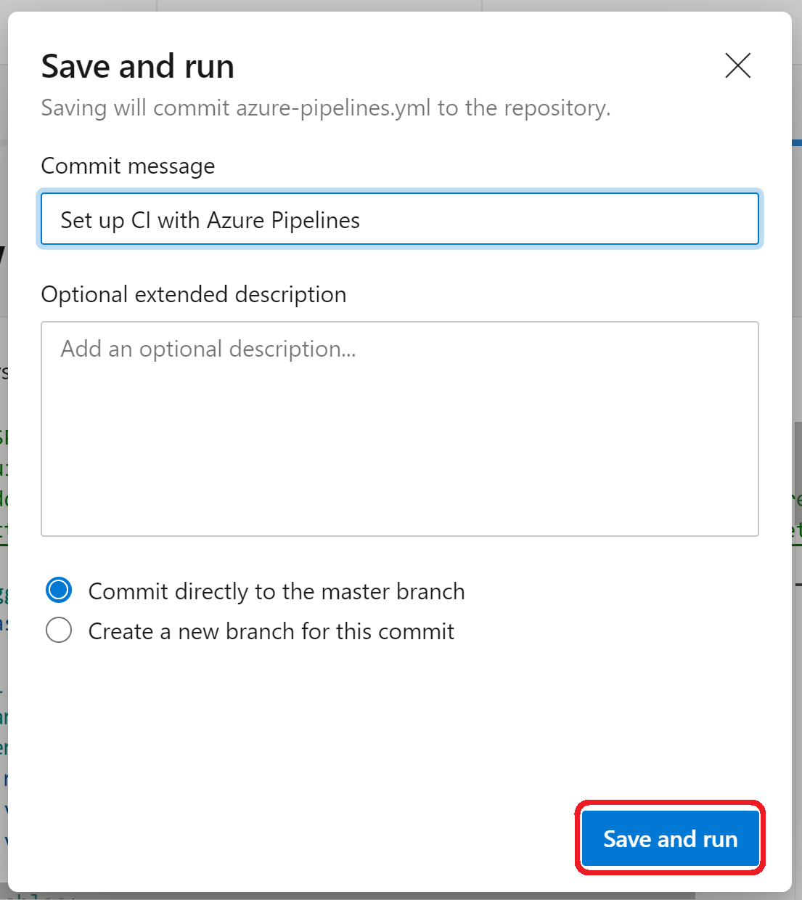
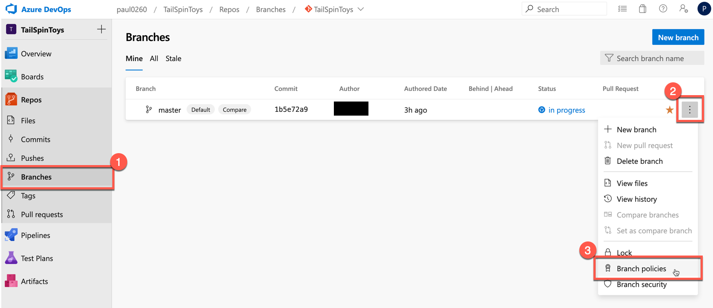
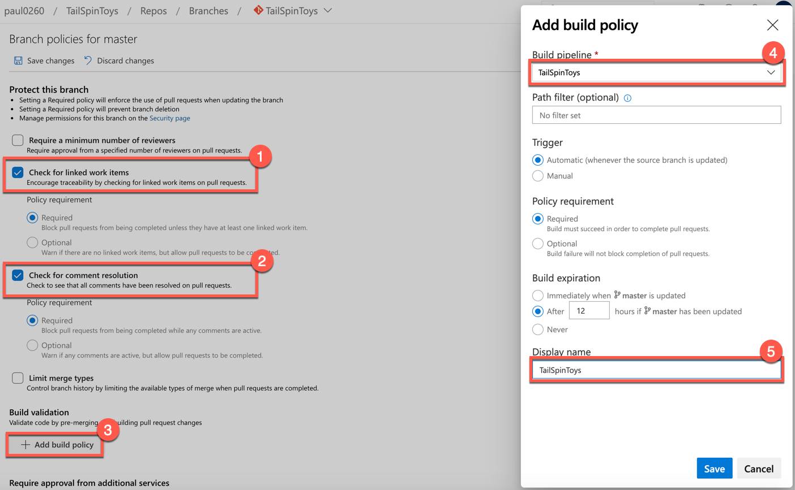
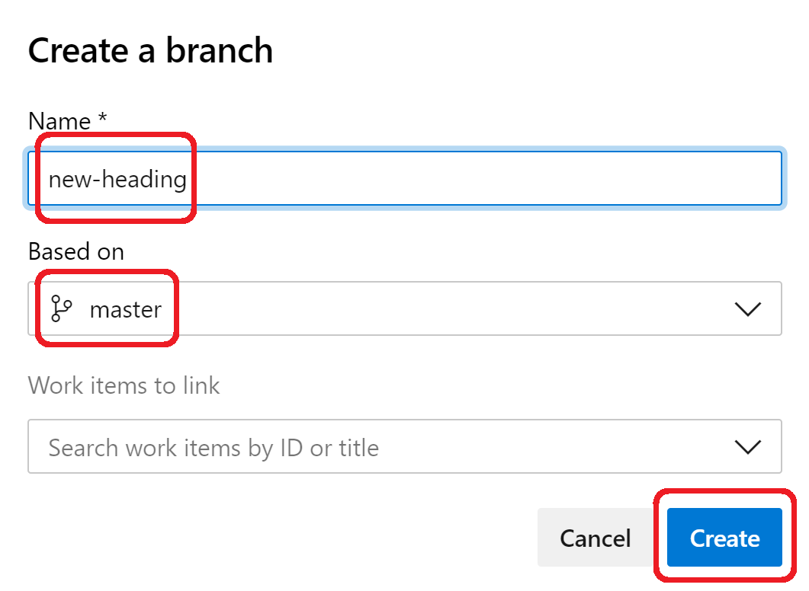
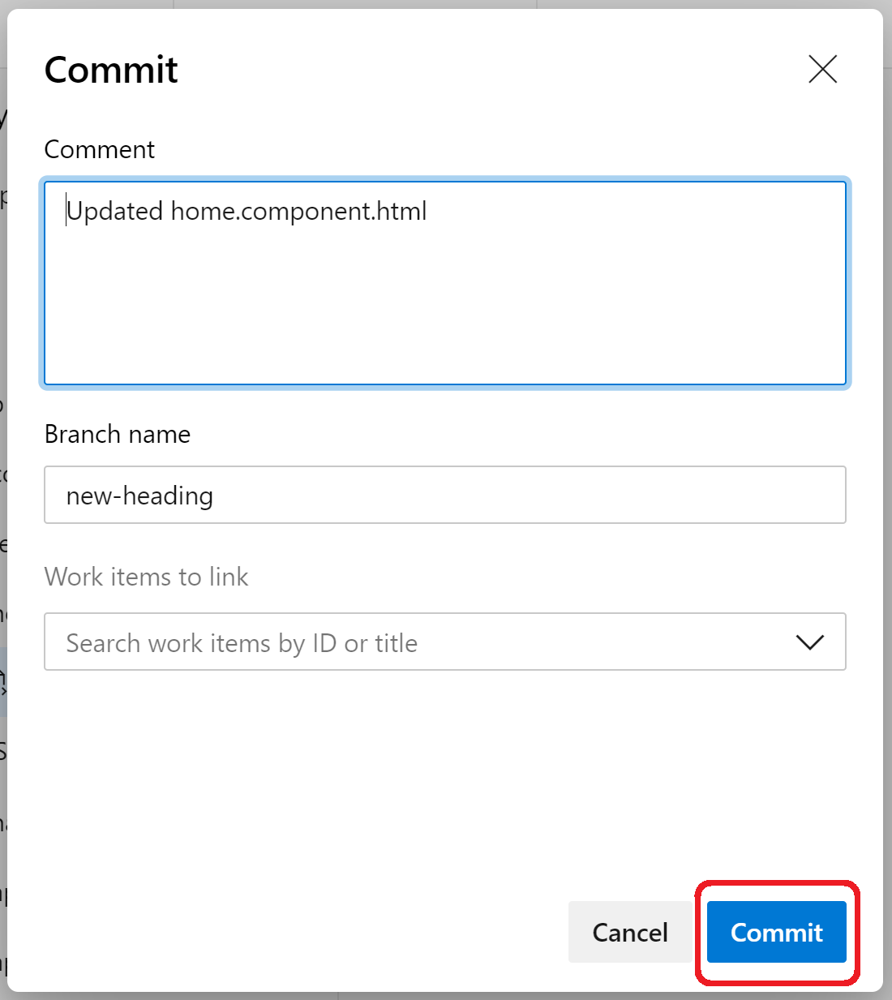

<div class="MCWHeader1">
Continuous delivery in Azure DevOps
</div>

<div class="MCWHeader2">
Hands-on lab step-by-step
</div>

<div class="MCWHeader3">
March 2020
</div>

Information in this document, including URL and other Internet Web site references, is subject to change without notice. Unless otherwise noted, the example companies, organizations, products, domain names, e-mail addresses, logos, people, places, and events depicted herein are fictitious, and no association with any real company, organization, product, domain name, e-mail address, logo, person, place or event is intended or should be inferred. Complying with all applicable copyright laws is the responsibility of the user. Without limiting the rights under copyright, no part of this document may be reproduced, stored in or introduced into a retrieval system, or transmitted in any form or by any means (electronic, mechanical, photocopying, recording, or otherwise), or for any purpose, without the express written permission of Microsoft Corporation.

Microsoft may have patents, patent applications, trademarks, copyrights, or other intellectual property rights covering subject matter in this document. Except as expressly provided in any written license agreement from Microsoft, the furnishing of this document does not give you any license to these patents, trademarks, copyrights, or other intellectual property.

The names of manufacturers, products, or URLs are provided for informational purposes only and Microsoft makes no representations and warranties, either expressed, implied, or statutory, regarding these manufacturers or the use of the products with any Microsoft technologies. The inclusion of a manufacturer or product does not imply endorsement of Microsoft of the manufacturer or product. Links may be provided to third party sites. Such sites are not under the control of Microsoft and Microsoft is not responsible for the contents of any linked site or any link contained in a linked site, or any changes or updates to such sites. Microsoft is not responsible for webcasting or any other form of transmission received from any linked site. Microsoft is providing these links to you only as a convenience, and the inclusion of any link does not imply endorsement of Microsoft of the site or the products contained therein.

© 2020 Microsoft Corporation. All rights reserved.

Microsoft and the trademarks listed at https://www.microsoft.com/en-us/legal/intellectualproperty/Trademarks/Usage/General.aspx are trademarks of the Microsoft group of companies. All other trademarks are property of their respective owners.

**Contents**
<!-- TOC -->

- [Continuous delivery in Azure DevOps hands-on lab step-by-step](#continuous-delivery-in-azure-devops-hands-on-lab-step-by-step)
  - [Abstract and learning objectives](#abstract-and-learning-objectives)
  - [Overview](#overview)
  - [Solution architecture](#solution-architecture)
  - [Requirements](#requirements)
  - [Exercise 1: Create an Azure Resource Manager (ARM) template that can provision the web application, PostgreSQL database, and deployment slots in a single automated process](#exercise-1-create-an-azure-resource-manager-arm-template-that-can-provision-the-web-application-postgresql-database-and-deployment-slots-in-a-single-automated-process)
    - [Task 1: Create an Azure Resource Manager (ARM) template using Azure Cloud Shell](#task-1-create-an-azure-resource-manager-arm-template-using-azure-cloud-shell)
    - [Task 2: Configure the list of release environments parameters](#task-2-configure-the-list-of-release-environments-parameters)
    - [Task 3: Add a deployment slot for the "staging" version of the site](#task-3-add-a-deployment-slot-for-the-staging-version-of-the-site)
    - [Task 4: Create the dev environment and deploy the template to Azure](#task-4-create-the-dev-environment-and-deploy-the-template-to-azure)
    - [Task 5: Create the test environment and deploy the template to Azure](#task-5-create-the-test-environment-and-deploy-the-template-to-azure)
    - [Task 6: Create the production environment and deploy the template to Azure](#task-6-create-the-production-environment-and-deploy-the-template-to-azure)
    - [Task 7: Review the resource groups](#task-7-review-the-resource-groups)
  - [Exercise 2: Create Azure DevOps project and Git Repository](#exercise-2-create-azure-devops-project-and-git-repository)
    - [Task 1: Create Azure DevOps Account](#task-1-create-azure-devops-account)
    - [Task 2: Add the Tailspin Toys source code repository to Azure DevOps](#task-2-add-the-tailspin-toys-source-code-repository-to-azure-devops)
  - [Exercise 3: Create Azure DevOps build pipeline](#exercise-3-create-azure-devops-build-pipeline)
    - [Task 1: Create a build pipeline](#task-1-create-a-build-pipeline)
  - [Exercise 4: Create Azure DevOps release pipeline](#exercise-4-create-azure-devops-release-pipeline)
    - [Task 1: Create a release definition](#task-1-create-a-release-definition)
    - [Task 2: Add test and production environments to release pipeline](#task-2-add-test-and-production-environments-to-release-pipeline)
  - [Exercise 5: Trigger a build and release](#exercise-5-trigger-a-build-and-release)
    - [Task 1: Manually queue a new build and follow it through the release pipeline](#task-1-manually-queue-a-new-build-and-follow-it-through-the-release-pipeline)
  - [Exercise 6: Setup a pull request policy, create a task branch and submit a pull request](#exercise-6-setup-a-pull-request-policy-create-a-task-branch-and-submit-a-pull-request)
    - [Task 1: Set up a pull request policy](#task-1-set-up-a-pull-request-policy)
    - [Task 2: Create a new branch](#task-2-create-a-new-branch)
    - [Task 3: Make a code change to the task branch](#task-3-make-a-code-change-to-the-task-branch)
    - [Task 4: Submit a pull request](#task-4-submit-a-pull-request)
    - [Task 5: Approve and complete a pull request](#task-5-approve-and-complete-a-pull-request)
  - [After the hands-on lab](#after-the-hands-on-lab)
    - [Task 1: Delete resources](#task-1-delete-resources)

<!-- /TOC -->

# Continuous delivery in Azure DevOps hands-on lab step-by-step

## Abstract and learning objectives 

In this hands-on lab, you will learn how to implement a solution with a combination of Azure Resource Manager templates and Azure DevOps to enable continuous delivery with several Azure PaaS services.

At the end of this workshop, you will be better able to implement solutions for continuous delivery with Azure DevOps in Azure, as well create an Azure Resource Manager (ARM) template to provision Azure resources, create an Azure DevOps project with a Git repository, and configure continuous delivery with Azure DevOps.

## Overview

Tailspin Toys has asked you to automate their development process in two specific ways. First, they want you to define an Azure Resource Manager template that can deploy their application into the Microsoft Azure cloud using Platform-as-a-Service technology for their web application and their PostgreSQL database. Second, they want you to implement a continuous delivery process that will connect their source code repository into the cloud, automatically run their code changes through unit tests, and then automatically create new software builds and deploy them onto environment-specific deployment slots so that each branch of code can be tested and accessed independently.

## Solution architecture



## Requirements

1.  Microsoft Azure subscription

  >**Note**: This entire lab can be completed using only the Azure Portal.

## Exercise 1: Create an Azure Resource Manager (ARM) template that can provision the web application, PostgreSQL database, and deployment slots in a single automated process

Duration: 45 Minutes

Tailspin Toys has requested three Azure environments (dev, test, production), each consisting of the following resources:

-   App Service

    -   Web App

    -   Deployment slots (for zero-downtime deployments)

-   PostgreSQL Server

    -   PostgreSQL Database

Since this solution is based on Azure Platform-as-a-Service (PaaS) technology, it should take advantage of that platform by utilizing automatic scale for the web app and the PostgreSQL Database PaaS service instead of running virtual machines.

### Task 1: Create an Azure Resource Manager (ARM) template using Azure Cloud Shell

1.  From within the **Azure Cloud Shell** locate the folder where you previously unzipped the Student Files. Open **Code** to this folder with the command below. It should also contain two sub-folders: **armtemplate** and **tailspintoysweb**.

    ```bash
    code .
    ```

    
  
2.  In the Code Explorer window, select the **armtemplate** sub-folder and open the **azuredeploy.json** file by selecting it.

    

3.  In the open editor window for the **azuredeploy.json**, scroll through the contents of the Azure Resource Manager Template. This template contains all the necessary code to deploy a Web App and a PostgreSQL database to Azure.

    >**Note**: If you would like to use this template in a future deployment of your own, it can be found in the [Azure Quickstart Templates repository on GitHub](https://github.com/Azure/azure-quickstart-templates). This specific file can be found [here](https://raw.githubusercontent.com/Azure/azure-quickstart-templates/master/101-webapp-managed-postgresql/azuredeploy.json).

### Task 2: Configure the list of release environments parameters

1.  Next, you need to configure a list of release environments we'll be deploying to. Our scenario calls for adding three environments: dev, test, and production. This is going to require the addition of some manual code. At the top of the **azuredeploy.json** file, locate the following line of code (on or around line 4).
    ```json
    "parameters": {
    ```  

2.  Insert the following code immediately below that line of code.

    ```json
    "environment": {
        "type": "string",
        "metadata": {
            "description": "Name of environment"
        },
        "allowedValues": [
          "dev",
          "test",
          "production"
        ]
    },
    ```

    After adding the code, it will look like this:

    

    Save the file.

    >**Note**: The **environment** parameter will be used to generate environment specific names for our web app.

### Task 3: Add a deployment slot for the "staging" version of the site

1.  Next, you need to add the "staging" deployment slot to the web app. This is used during a deployment to stage the new version of the web app. This is going to require the addition of some manual code. In the **azuredeploy.json** file, add the following code to the "resources" array, just above the element for the "connectionstrings" (on or around line 156).

    ```json
    {
        "apiVersion": "2016-08-01",
        "name": "staging",
        "type": "slots",
        "tags": {
            "displayName": "Deployment Slot: staging"
        },
        "location": "[resourceGroup().location]",
        "dependsOn": [
            "[resourceId('Microsoft.Web/Sites/', variables('webAppName'))]"
        ],
        "properties": {
        },
        "resources": []
    },
    ```

    After adding the code, it will look like this:

    Save the file.

    

    The complete ARM template should look like the following:

    ```json
    {
        "$schema": "https://schema.management.azure.com/schemas/2015-01-01/deploymentTemplate.json#",
        "contentVersion": "1.0.0.0",
        "parameters": {
            "environment": {
                "type": "string",
                "metadata": {
                    "description": "Name of environment"
                },
                "allowedValues": [
                    "dev",
                    "test",
                    "production"
                ]
            },
            "siteName": {
                "type": "string",
                "defaultValue": "tailspintoys",
                "metadata": {
                    "description": "Name of azure web app"
                }
            },
            "administratorLogin": {
                "type": "string",
                "minLength": 1,
                "metadata": {
                    "description": "Database administrator login name"
                }
            },
            "administratorLoginPassword": {
                "type": "securestring",
                "minLength": 8,
                "maxLength": 128,
                "metadata": {
                    "description": "Database administrator password"
                }
            },
            "databaseSkuCapacity": {
                "type": "int",
                "defaultValue": 2,
                "allowedValues": [
                    2,
                    4,
                    8,
                    16,
                    32
                ],
                "metadata": {
                    "description": "Azure database for PostgreSQL compute capacity in vCores (2,4,8,16,32)"
                }
            },
            "databaseSkuName": {
                "type": "string",
                "defaultValue": "GP_Gen5_2",
                "allowedValues": [
                    "GP_Gen5_2",
                    "GP_Gen5_4",
                    "GP_Gen5_8",
                    "GP_Gen5_16",
                    "GP_Gen5_32",
                    "MO_Gen5_2",
                    "MO_Gen5_4",
                    "MO_Gen5_8",
                    "MO_Gen5_16",
                    "MO_Gen5_32"
                ],
                "metadata": {
                    "description": "Azure database for PostgreSQL sku name "
                }
            },
            "databaseSkuSizeMB": {
                "type": "int",
                "allowedValues": [
                    102400,
                    51200
                ],
                "defaultValue": 51200,
                "metadata": {
                    "description": "Azure database for PostgreSQL Sku Size "
                }
            },
            "databaseSkuTier": {
                "type": "string",
                "defaultValue": "GeneralPurpose",
                "allowedValues": [
                    "GeneralPurpose",
                    "MemoryOptimized"
                ],
                "metadata": {
                    "description": "Azure database for PostgreSQL pricing tier"
                }
            },
            "postgresqlVersion": {
                "type": "string",
                "allowedValues": [
                    "9.5",
                    "9.6"
                ],
                "defaultValue": "9.6",
                "metadata": {
                    "description": "PostgreSQL version"
                }
            },
            "location": {
                "type": "string",
                "defaultValue": "[resourceGroup().location]",
                "metadata": {
                    "description": "Location for all resources."
                }
            },
            "databaseskuFamily": {
                "type": "string",
                "defaultValue": "Gen5",
                "metadata": {
                    "description": "Azure database for PostgreSQL sku family"
                }
            }
        },
        "variables": {
            "webAppName": "[concat(parameters('siteName'), '-', parameters('environment'), '-', uniqueString(resourceGroup().id))]",
            "databaseName": "[concat(parameters('siteName'), 'db', parameters('environment'), uniqueString(resourceGroup().id))]",
            "serverName": "[concat(parameters('siteName'), 'pgserver', parameters('environment'), uniqueString(resourceGroup().id))]",
            "hostingPlanName": "[concat(parameters('siteName'), 'serviceplan', uniqueString(resourceGroup().id))]"
        },
        "resources": [
            {
                "apiVersion": "2016-09-01",
                "name": "[variables('hostingPlanName')]",
                "type": "Microsoft.Web/serverfarms",
                "location": "[parameters('location')]",
                "properties": {
                    "name": "[variables('hostingPlanName')]",
                    "workerSize": "1",
                    "hostingEnvironment": "",
                    "numberOfWorkers": 0
                },
                "sku": {
                    "Tier": "Standard",
                    "Name": "S1"
                }
            },
            {
                "apiVersion": "2016-08-01",
                "name": "[variables('webAppName')]",
                "type": "Microsoft.Web/sites",
                "location": "[parameters('location')]",
                "dependsOn": [
                    "[concat('Microsoft.Web/serverfarms/', variables('hostingPlanName'))]"
                ],
                "properties": {
                    "name": "[variables('webAppName')]",
                    "serverFarmId": "[variables('hostingPlanName')]",
                    "hostingEnvironment": ""
                },
                "resources": [
                    {
                        "apiVersion": "2016-08-01",
                        "name": "staging",
                        "type": "slots",
                        "tags": {
                            "displayName": "Deployment Slot: staging"
                        },
                        "location": "[resourceGroup().location]",
                        "dependsOn": [
                            "[resourceId('Microsoft.Web/Sites/', variables('webAppName'))]"
                        ],
                        "properties": {},
                        "resources": []
                    },
                    {
                        "apiVersion": "2016-08-01",
                        "name": "connectionstrings",
                        "type": "config",
                        "dependsOn": [
                            "[concat('Microsoft.Web/sites/', variables('webAppName'))]"
                        ],
                        "properties": {
                            "defaultConnection": {
                                "value": "[concat('Database=', variables('databaseName'), ';Server=', reference(resourceId('Microsoft.DBforPostgreSQL/servers',variables('serverName'))).fullyQualifiedDomainName, ';User Id=', parameters('administratorLogin'),'@', variables('serverName'),';Password=', parameters('administratorLoginPassword'))]",
                                "type": "PostgreSQL"
                            }
                        }
                    }
                ]
            },
            {
                "apiVersion": "2017-12-01",
                "type": "Microsoft.DBforPostgreSQL/servers",
                "location": "[parameters('location')]",
                "name": "[variables('serverName')]",
                "sku": {
                    "name": "[parameters('databaseSkuName')]",
                    "tier": "[parameters('databaseSkuTier')]",
                    "capacity": "[parameters('databaseSkucapacity')]",
                    "size": "[parameters('databaseSkuSizeMB')]",
                    "family": "[parameters('databaseskuFamily')]"
                },
                "properties": {
                    "version": "[parameters('postgresqlVersion')]",
                    "administratorLogin": "[parameters('administratorLogin')]",
                    "administratorLoginPassword": "[parameters('administratorLoginPassword')]",
                    "storageMB": "[parameters('databaseSkuSizeMB')]"
                },
                "resources": [
                    {
                        "type": "firewallRules",
                        "apiVersion": "2017-12-01",
                        "dependsOn": [
                            "[concat('Microsoft.DBforPostgreSQL/servers/', variables('serverName'))]"
                        ],
                        "location": "[parameters('location')]",
                        "name": "[concat(variables('serverName'),'firewall')]",
                        "properties": {
                            "startIpAddress": "0.0.0.0",
                            "endIpAddress": "255.255.255.255"
                        }
                    },
                    {
                        "name": "[variables('databaseName')]",
                        "type": "databases",
                        "apiVersion": "2017-12-01",
                        "properties": {
                            "charset": "utf8",
                            "collation": "English_United States.1252"
                        },
                        "dependsOn": [
                            "[concat('Microsoft.DBforPostgreSQL/servers/', variables('serverName'))]"
                        ]
                    }
                ]
            }
        ]
    }    
    ```

### Task 4: Create the dev environment and deploy the template to Azure

Now that the template file has been uploaded, we'll deploy it several times to create each of our desired environments: *dev*, *test*, and *production*. Let's start with the **dev** environment.

1.  In the **Azure Cloud Shell** terminal, from the same folder that your ARM template resides in, enter the following command and press **Enter**:

    ```bash
    echo "Enter the Resource Group name:" &&
    read resourceGroupName &&
    echo "Enter the location (i.e. westus, centralus, eastus):" &&
    read location &&
    az group create --name $resourceGroupName --location "$location" &&
    az group deployment create --resource-group $resourceGroupName --template-file "$HOME/studentfiles/armtemplate/azuredeploy.json"
    ```
    
    >**Note**: This command is designed to prompt us to enter the resource group name and Azure region (location) we want to deploy our resources to. The script then takes our inputs and passes them as parameters to the Azure CLI command that calls our recently uploaded template file.

    >**Note**: If you've extracted the student files in a different directory than the one indicated in 'Before the hands-on lab' Task 2.2, you will get an error similar to *'[Errno 2] No such file or directory: '/home/username/studentfiles/armtemplate/azuredeploy.json'*. In this case, you should replace $HOME/studentfiles/armtemplate with the path of the directory you chose.

    

2.  Enter the name of a resource group you want to deploy the resources to (i.e. TailSpinToysRG). If it does not already exist, the template will create it. Then, press **Enter**.

3.  Next, we're prompted to enter an Azure region (location) where we want to deploy our resources to (i.e. westus, centralus, eastus). 
    
    Enter the name of an Azure region and then press **Enter**.
   
4.  Next, we're asked to enter a choice for environments we want to deploy to. The template will use our choice to concatenate the name of the environment with the name of the resource during provisioning. 
    
    For this first run, select the *dev* environment by entering **1** and then pressing **Enter**.
    
     

5.  Next, we're asked to supply an administrator login (username) for the PostgreSQL server and database. This will be the username credential you would need to enter to connect to your newly created database. 
    
    Enter a value for the *administratorLogin* (e.g. **azureuser**) and then press **Enter**.

    

6.  Next, we're asked to supply an administrator password for the PostgreSQL server and database. This will be the password credential you would need to enter to connect to your newly created database.

    >**Note**: The password must meet complexity requirements of 8 or more characters, must contain upper and lower case characters, must contain at least one number and at least one special character, e.g. "Database2020!"

    Enter a value for the *administratorLoginPassword* and then press **Enter**.

7. This will kick off the provisioning process which takes a few minutes to create all the resources for the environment. This is indicated by the "Running" text displayed at the bottom of the Azure Cloud Shell while the command is executing.

    

8. After the template has completed, JSON is output to the Azure Cloud Shell window with a *Succeeded* message.

    

    >**Note**: The above steps were used to provision the *dev* environment. Most of these same steps will be repeated for the *test* and *production* environments below.

### Task 5: Create the test environment and deploy the template to Azure

The following steps are very similar to what was done in the previous task with the exception that you are now creating the **test** environment. Repeat the above steps and select to create the **2. test** environment. You can use the same values as used in the dev environment.

### Task 6: Create the production environment and deploy the template to Azure

The following steps are very similar to what was done in the previous task with the exception that you are now creating the **production** environment. Repeat the above steps and select to create the **3. production** environment. You can use the same values as used in the dev environment.

### Task 7: Review the resource groups

1. In the Azure Portal, navigate to the resource group where all of the resources have been deployed. It should look similar to the screenshot below.

    >**Note**: The specific names of the resources will be slightly different than what you see in the screenshot based on the unique identities assigned.

    

## Exercise 2: Create Azure DevOps project and Git Repository

Duration: 15 Minutes

In this exercise, you will create and configure an Azure DevOps account along with an Agile project.

### Task 1: Create Azure DevOps Account

1. Browse to the Azure DevOps site at <https://dev.azure.com>.

2. If you do not already have an account, select the **Start free** button.
    
    

3. Authenticate with a Microsoft account.

4. Choose **Continue** to accept the Terms of Service, Privacy Statement, and Code of Conduct.

5. Choose a name for new your project. For the purposes of this scenario, we will use *TailspinToys*. Choose **Private** in the Visibility section so that our project is only visible to those who we specifically grant access. Then, select **+ Create project**.
    
    

6. Once the Project is created, choose the **Repos** menu option in the left-hand navigation.

    

7. On the *Repos* page for the **TailspinToys** repository and locate the "Push an existing repository from command line" section. Choose the **Copy push commands to clipboard** button to copy the contents of the panel. We're going to use these commands in an upcoming step.

    

### Task 2: Add the Tailspin Toys source code repository to Azure DevOps

In this Task, you will configure the Azure DevOps Git repository. You will configure the remote repository using Git and then push the source code up to Azure DevOps through the command line tools.

1. Open the *Azure Cloud Shell* to the folder where the Student Files were unzipped (e.g. studentfiles). Then, navigate to the **tailspintoysweb** folder which contains the source code for our web application.

    > **Note**: If this folder doesn't exist ensure you followed the instructions in the 'Before the hands-on lab'.

    >**Note**: If you are using the Azure Cloud Shell you will be prompted for credentials when using Git. The best way to authenticate is to use a [personal access token](https://docs.microsoft.com/en-us/azure/devops/organizations/accounts/use-personal-access-tokens-to-authenticate), PAT, with a scope Code, Full permissions. Then use that PAT as password (leave user name empty) when prompted.    

2. Open *Cloud Shell Editor* to this folder by typing: 
   
   ```bash
   code .
   ``` 

   Then press **Enter**. 
   
   >**Note**: Be sure to include the period after the code command as this instructs Code to open the current directory context.
   
3. In *Azure Cloud Shell*, initialize a local Git repository by running the following command:

    > If a ".git" folder and local repository already exists in the folder, then you will need to delete the ".git" folder first before running the commands below to initialize the Git repository.

    ```bash
    git init
    ```

4. Paste the first command you copied from Azure DevOps. It will resemble the command below:
    
    ```bash
    git remote add origin https://<your-org>@dev.azure.com/<your-org>/TailspinToys/_git/TailspinToys
    git push -u origin --all
    ```

5. In case the *Password for 'https://\<your-org>@dev.azure.com':* prompt appears, follow the next steps to generate a PAT (Personal Access Token) for your Azure DevOps organization. Otherwise, skip to step 13.
    
    > **Note**: These steps are also useful when using a multi-factored protected user account with Azure DevOps.
    
    > **Note**: **DO NOT CLOSE AZURE CLOUD SHELL**. Use a different tab for the steps for creating a new PAT token.

6. In *Azure DevOps*, choose on the second to last icon on the top menu in the left-hand side of the screen, representing a user and a small gear icon.

7. From the context menu, choose **Personal access tokens**.

    

8. If the *Create a new personal access token* dialog has appeared, skip to the next step. Otherwise, select the **+ New Token** button.

    

9. In the *Create a new personal access token* dialog, type in a descriptive name for the new token, and from the *Code* section, choose **Full** and **Status**.

    

10. In the *Create a new personal access token* dialog, select the **Create** button.

11. From the success confirmation dialog, select the **Copy to clipboard** button to copy the newly created PAT token to clipboard.

    

12. In *Azure Cloud Shell*, paste the PAT token and press **Enter**.

13. Type in the following commands to commit the changes made locally to the new repository:
    
    ```bash
    git add *
    git commit -m "adding files"
    ```

14. Push the changes up to the Azure DevOps repository with the following command:

    ```
    git push --set-upstream origin master
    ```

15. Navigate to the Repos > Files page which shows the files in the repository. You may need to refresh the page to see the updated files. Your source code is now appearing in Azure DevOps.

    

16. Expand the *ClientApp* directory. Choose the **package.json** file.

17. On line 27, change the value representing the version of the *rxjs* dependency, from *^6.0.0* to **6.0.0** (without the '^' character).

    

18. Next, hover the **package-lock.json** file and from the context menu, choose **Delete**.

    

19. Confirm the deletion.

20. In the upper-right side of the page, choose **Commit**.

21. In the *Commit* dialog, validate the commit message and choose **Commit**.

## Exercise 3: Create Azure DevOps build pipeline

Duration: 15 Minutes

Implementing CI and CD pipelines helps to ensure consistent and quality code that's readily available to users. Azure Pipelines is a quick, easy, and safe way to automate building your projects and making them available to users.

In this exercise, you will create a build definition using Azure Pipelines, that will automatically build the web application with every commit of source code. This will lay the groundwork for us to then create a release pipeline for publishing the code to our Azure environments.
  
### Task 1: Create a build pipeline

Pipelines are made of one or more stages describing a CI/CD process. Stages are the major divisions in a pipeline: "build this app", "run these tests", and "deploy to pre-production" are good examples of stages.

Stages consist of one or more jobs, which are units of work assignable to a particular machine. Both stages and jobs may be arranged into dependency graphs: "run this stages before that one" or "this job depends on the output of that job".

Jobs consist of a linear series of steps. Steps can be tasks, scripts, or references to external templates.

This hierarchy is reflected in the structure of a YAML file.

1. In your Azure DevOps project, select the **Pipelines** menu option from the left-hand navigation.

    

2. Select the **Create pipeline** button to create a new build pipeline.

    

3. This starts a wizard where you'll first need to select where your current code is located. In a previous step, you pushed code up to Azure Repos. Select the **Azure Repos Git** option.

    

4. Next, you'll need to select the specific repository where your code was pushed. In a previous step, you pushed it to the **TailspinToys** repository. Select the **TailspinToys** git repository.

    

5. Then, you'll need to select the type of pipeline to configure. Although this pipeline contains a mix of technologies, select **ASP.NET Core** from the list of options.

    

6. As a final step in the creation of a build pipeline, you are presented with a configured pipeline in the form of an azure-pipelines.yml file. 
   
7. This starter YAML file contains a few lines of instructions (shown below) for the pipeline. Let's begin by updating the YAML with more specific instructions to build our application. 

    

The *pool* section specifies which pool to use for a job of the pipeline. It also holds information about the job's strategy for running.

8. Select and replace the *pool* section with the following code:

    ```yml
    pool:
      vmImage: 'windows-latest'
      demands:
      - msbuild
      - visualstudio
      - vstest
    ```

    Steps are a linear sequence of operations that make up a job. Each step runs in its own process on an agent and has access to the pipeline workspace on disk. This means environment variables are not preserved between steps but, file system changes are.

9. Select and replace the *steps* section with the following code:
    
    ```yml
    steps:
    - task: NuGetToolInstaller@0
      displayName: 'Use NuGet 4.4.1'
      inputs:
        versionSpec: 4.4.1      
    ```

    Tasks are the building blocks of a pipeline. They describe the actions that are performed in sequence during an execution of the pipeline.

10. Add additional tasks to your azure-pipelines.yml file by selecting and copying the following code. This should be pasted right after the NuGetToolInstaller@0 task which you pasted previously:
    
    >**Note**: The YAML below creates individual tasks for performing all the necessary steps to build and test our application along with publishing the artifacts inside Azure DevOps so they can be retrieved during the upcoming release pipeline process.

    ```yml
    - task: NuGetCommand@2
      displayName: 'NuGet restore'
      inputs:
        restoreSolution: '**/tailspintoysweb.csproj'

    # Node.js tool installer
    # Finds or downloads and caches the specified version spec of Node.js and adds it to the PATH
    - task: NodeTool@0
      inputs:
        versionSpec: '10.x' 

    - task: VSBuild@1
      displayName: 'Build solution'
      inputs:
        solution: '**/tailspintoysweb.csproj'
        msbuildArgs: '/p:DeployOnBuild=true /p:WebPublishMethod=Package /p:PackageAsSingleFile=true /p:SkipInvalidConfigurations=true /p:PackageLocation="$(build.artifactstagingdirectory)\\"'
        platform: 'any cpu'
        configuration: 'release'

    - task: PublishSymbols@2
      displayName: 'Publish symbols path'
      inputs:
        SearchPattern: '**\bin\**\*.pdb'
        PublishSymbols: false
      continueOnError: true

    - task: PublishBuildArtifacts@1
      displayName: 'Publish Artifact'
      inputs:
        PathtoPublish: '$(build.artifactstagingdirectory)'
        ArtifactName: 'TailspinToys-CI'
      condition: succeededOrFailed()
    ```

11. The final result will look like the following:

    ```yml
    trigger:
      - master

    pool:
      vmImage: 'windows-latest'
      demands:
      - msbuild
      - visualstudio
      - vstest

    steps:
    - task: NuGetToolInstaller@0
      displayName: 'Use NuGet 4.4.1'
      inputs:
        versionSpec: 4.4.1

    # Node.js tool installer
    # Finds or downloads and caches the specified version spec of Node.js and adds it to the PATH
    - task: NodeTool@0
      inputs:
        versionSpec: '10.x' 

    - task: NuGetCommand@2
      displayName: 'NuGet restore'
      inputs:
        restoreSolution: '**/tailspintoysweb.csproj'

    - task: VSBuild@1
      displayName: 'Build solution'
      inputs:
        solution: '**/tailspintoysweb.csproj'
        msbuildArgs: '/p:DeployOnBuild=true /p:WebPublishMethod=Package /p:PackageAsSingleFile=true /p:SkipInvalidConfigurations=true /p:PackageLocation="$(build.artifactstagingdirectory)\\"'
        platform: 'any cpu'
        configuration: 'release'

    - task: PublishSymbols@2
      displayName: 'Publish symbols path'
      inputs:
        SearchPattern: '**\bin\**\*.pdb'
        PublishSymbols: false
      continueOnError: true

    - task: PublishBuildArtifacts@1
      displayName: 'Publish Artifact'
      inputs:
        PathtoPublish: '$(build.artifactstagingdirectory)'
        ArtifactName: 'TailspinToys-CI'
      condition: succeededOrFailed()
    ```

12. Choose the **Save and run** button to save our new pipeline and also kick off the first build.

        

13. The new *azure-pipelines.yml* file will automatically be added to the root of your TailspinToys repository. This is done through a git commit that Azure DevOps facilitates. You are then asked to enter a commit description. By default, it will be populated for you. Once again, select the **Save and run** button at the bottom of the screen.

       

14. The build process will immediately begin and run through the steps defined in the azure-pipelines.yml file. Your Azure DevOps screen will refresh to show you the build process executing, in real-time. 

       

15. After the build process completes, you should see a green check mark next to each of the build pipeline steps.
  
     
    
    Congratulations! You have just created your first build pipeline. In the next exercise, we will create a release pipeline that deploys your successful builds.

## Exercise 4: Create Azure DevOps release pipeline

Duration: 30 Minutes

In this exercise, you will create a release pipeline in Azure DevOps that performs automated deployment of build artifacts to Microsoft Azure. The release pipeline will deploy to three stages: dev, test, and production.

### Task 1: Create a release definition

1. Select **Releases** on the left-hand navigation. This will bring up the Releases screen. 

    

2. Choose the **New pipeline** button to begin the creation of a new release pipeline.

    

3. Then, you'll need to select the template that matches the pipeline you are building. Since we are deploying an Azure App Service, select **Azure App Service deployment** from the list of templates and choose the **Apply** button.

    

4. This will present you with the New release pipeline editor which allows you to manage your release stages. A stage is a logical and independent concept that represents where you want to deploy a release generated from a release pipeline. Often times, this is considered an environment. Let's start by giving this stage a name. Change the value "Stage 1" in the editor to **"dev"** and then select the **"X"** in the top-right corner to close the panel and save the name change.

    

5. A release consists of a collection of artifacts in your CD/CD process. An artifact is any deployable component of your application. When authoring a release pipeline, you link the appropriate artifact sources to your release pipeline. In this step, we will connect the artifacts from our previously created build pipeline to this newly created release pipeline. Select the **+ Add** button next to *Artifacts* or the **+ Add an artifact** icon inside the *Artifacts* box. Both buttons perform the same action.

    

6. The *Add an artifact* panel will display several configurations for linking to an artifact. 
    
    In the **Source (build pipeline)** dropdown list, select **TailspinToys**. 
    
    In the **Default version** field, select **Latest**. 
    
    The panel fields will adjust to show additional details based on your selection. The default values will produce a new release when future builds successfully complete. 
    
    Select the **Add** button.

    

7. Now, it is time to begin configuring specific tasks to perform our deployment during the dev stage. 

    To navigate to the task editor, select the **Task** menu item.

    

8. This brings up the task editor and opens a panel with configuration details for the dev stage we created earlier. The configuration items set here will be made available to the tasks in this stage.

9. On this panel, we first need to configure the necessary details to connect the task to Azure for deployment. Let's first start by connecting to our Azure subscription. Select your Azure subscription from the *Azure subscription* dropdown and then choose the **Authorize** button to login and authenticate to the selected subscription.

10. In case a 'Service connection operation failed' dialog pops up, follow the next steps to manually create a service connection. You would also like to follow these steps in case you want to granularly configure permissions for Azure DevOps to a single resource group rather than the entire subscription.

    **If you successfully authorized the Azure Subscription you may skip to step 34.**

    > **Note**: The following workaround steps must be performed by a Global Administrator of the tenant associated to the Azure subscription, or at least an individual who has access to a user account with either of these Azure Active Directory roles: Application administrator, Application developer, Cloud application administrator.
        
11. In the Azure Portal, open the **Azure Active Directory** page.

12. In the *Azure Active Directory* page, choose **App registrations**.

13. In the *App registrations* page, choose **+ New registration**.

14. In the *Register an application*, type in a name for the application (e.g. **MCWAzureDevOps**).

15. For *Supported account types*, choose *Accounts in this organizational directory only*.

16. Select the **Register** button.

17. In the application page, note down the **Application (client) ID** - this will be used at a later step in this task and will be referred to as *Application ID*.

18. In the application page, note down the **Directory (tenant) ID** - this will be used at a later step in this task and will be referred to as *Directory ID*.

19. Choose **Certificates & secrets**.

20. In the *Certificates & secrets* page, select **+ New client secret**.

21. In the *Add a client secret* dialog, type in a descriptive description and choose **Never** for the expiration of the secret.

22. Select **Add**.

23. Copy the value of the secret now. This will not be displayed later and will be used at a later step in this task. The secret will be referred to as *Client secret*.

24. In the Azure Portal, open the **TailspinToysRg** resource group.

25. On the left-side of the page, choose **Access control (IAM)**.

26. On the top-menu, choose **+ Add**.

27. From the drop-down menu, choose **Add role assignment**.

28. In the **Add role assignment**, type in the following information:

    - For *Role*, choose **Contributor**
    - For *Select*, type in the name of the application you previously registered (e.g. *MCWAzureDevOps*)

    ")

29. Select the application returned from the query and choose **Save**. 

30. In Azure DevOps, in the *Deployment process* parameters, select the **+New** button for the parameter called *Azure subscription*.

    

31. In the *Add an Azure Resource Manager service connection* dialog, type in the following:

    - For *Connection name*, type in a descriptive name which represents the connection your establishing between your Azure DevOps organization and Azure.
    - For *Environment*, choose **AzureCloud**.
    - For *Scope level*, choose **Subscription**.
    - For *Subscription ID*, type in your Azure subscription identifier where the resources were previously created. You may retrieve this information from running the following Azure CLI command in the Azure Cloud Shell editor previously used for provisioning and copying the value of the *id* property:

    ```
    az account show
    ```

    - For *Subscription name*, type in the exact name of the Azure subscription. Again, this information can be retrieved by using the same Azure CLI command previously described
    - For *Service principal client ID*, *Service principal key* and *Tenant ID*, type in the **Client ID**, **Client secret** and **Directory ID** values copied previously.

    

32. Choose the **Verify connection** button to validate the typed in information.

33. If the verification is successful, choose the **OK** button. The newly added service connection should show up in the *Azure subscription* parameter; otherwise, select the **Refresh** button next to the parameter.

34. Then, in the *App service name field* select the one that begins with **tailspintoys-dev-**.

    

35. Now, let's configure the task specific details. Select the **Deploy Azure App Service** task to bring up the configuration panel for task.

    

36. In a previous exercise, we created a deployment slot for the web app. Deployment slots are actually live apps with their own hostnames. App content and configuration elements can be swapped between two deployment slots, including the production slot. 

    In the *Azure App Service Deploy* panel, locate the **Deploy to Slot or App Service Environment** checkbox and set it to checked.

    

37. The checkbox will trigger the panel to update with additional configuration items. 

    In the **Resource group** dropdown, select the appropriate resource group you created in the previous exercise. 
    
    In the **Slot** dropdown, select **staging**.

    

38. Now that we've completed the configuration for the "Deploy Azure App Service" task to deploy our application to Azure App Service deployment slot, we'll need a way to swap the staging slot with the production slot. To do that, we'll need to add an additional task to the dev stage. 

    Select the **+** (plus sign) on the task list to create a new task.

    

39. This opens the *Add tasks* panel. 

    Enter **App Service Manage** into the search box and press **Enter**. 
    
    Then select the **Azure App Service Manage** task from the search results and select the **Add** button.

    

40. After adding the new task, we now have two tasks for the dev stage. The new task now needs to be configured. 

    Select the **Swap Slots:** task to open the task configuration panel.

    

41. In the *Azure App Service Manage* task panel there are a few configurations we need to set. 

    First, locate the *Azure subscription* field and select the same subscription used in the *Deploy Azure App Service* task.

42. Locate the *App Service name* field, select the item that begins with **TailspinToysWeb-dev-** just like in the *Deploy Azure App Service* task. 

    In the *Resource Group* field, select **TailspinToysRg**. 
    
    In the *Source Slot* field, select **staging**.

    

43. Let's wrap up this activity by giving our release pipeline a new name. 

    Choose the existing *New release pipeline* name to begin editing it. 
    
    Change the name to **TailspinToys Release**.

    

44. Select **Save** button at the top of the screen and confirm by selecting the **OK** button.

45. Congratulations! You have just created your first release pipeline.

### Task 2: Add test and production environments to release pipeline

1. On the Pipeline tab, move your mouse over the dev stage and a select the **Clone** button to create a copy of the tasks from the dev stage. We will use the same steps to deploy to test with a few configuration changes.

    

2. Select the newly created stage titled "Copy of dev" to bring up the stage configuration panel.

3. Change the *Stage name* to **test** and then close the panel.

4. Now, we will begin modifying the configuration specifics for the test stage. Select the *1 job, 2 tasks* link for the test stage.

    

5. This opens the configuration panel for the stage and includes several pre-populated fields. 

6. On the *Tasks* tab header option, choose the arrow pointing down, in order to validate that the *test* stage configuration menu is indeed shown.

    

7. In the *Tasks* section, choose on the *test* deployment process to select its stage parameters.

8. Locate the **App service name** parameter and change the value to the app service that starts with **tailspintoys-test-**.

    

9. Select the *Deploy Azure App Service* task to bring up the task configuration panel. Notice the settings are the same as when we configured it for the dev stage because we cloned the dev stage to create the test stage. You may need to scroll down the panel to see additional fields.

10. Locate the **Resource group** field and select the resource group you created earlier. Then, locate the **Slot** field and select **staging**.

    

11. Now, select the *Swap Slots* task to bring up the task configuration panel. 

    First, locate the **Display name** field and simplify it to **Swap Slots**. 
    
    Then, locate the **App Service name** and select the app service that starts with **tailspintoys-test-**. 
    
    Next, locate the **Resource group** field and change the value to the resource group you created earlier. Finally, locate the **Source Slot** field and set it to **staging**.

    

9. Select the **Save** button at the top of the screen and confirm by choosing the **OK** button.

10. Congratulations! You have just created a test stage and added it to your pipeline.

11. **Repeat all of the steps in Task 2 to create a production stage being careful to enter *production* as a replacement for *test* and selecting *tailspintoys-production* instead of *tailspintoys-test* where applicable. Do not forget to configure to individual steps in the newly cloned production environment.**

12. The final release pipeline should look like the screen shot below:

    

13. Now you will enable the continuous deployment trigger, so the release process automatically begins as soon as a build successfully completes. To do this, select the lightning bolt icon in the Artifacts window.

14. This will bring up the *Continuous deployment trigger* panel. Change the setting to **Enabled**.

    

15. Select **Save** and confirm your changes by choosing **OK**. Then, close the panel.

Congratulations! You have completed the creation of a release pipeline with three stages.

## Exercise 5: Trigger a build and release

Duration: 10 Minutes

In this exercise, you will trigger an automated build and release of the web application using the build and release pipelines you created in earlier exercises. The release pipeline will deploy to three stages: dev, test, and production.

Any commit of new or modified code to the master branch will automatically trigger a build. The steps below are useful when you want to manually trigger a build without a code change.

### Task 1: Manually queue a new build and follow it through the release pipeline

1. Select the *Pipelines* menu item from the left-hand navigation. 

2. In the *Pipelines* view, choose the *TailspinToys* pipeline recently created.

3. In the *TailspinToys* pipeline runs page, choose the *Run pipeline* button in the upper right section of the page.

    

4. This will present a modal window titled *Run pipeline*. Choose the **Run** button at the bottom of the modal window.

    

5. The screen will refresh and begin to show details about the build process.

6. Once the build completes, it will resemble the snippet below.

    

7. Because we configured continuous deployment, the deployment to the dev stage will automatically be triggered. It will continue through on to the test and production stages. A successful release through all three stages will look like the screen shot below.

    

## Exercise 6: Setup a pull request policy, create a task branch and submit a pull request

Duration: 30 Minutes

In this exercise, you will first set up a Pull request policy for your master branch, then you will create a short-lived task branch, make a small code change, commit and push the code, and submit a pull request. 
You'll then merge the pull request into the master branch which triggers an automated build and release of the application.

In the tasks below, you will make changes directly through the Azure DevOps web interface. These steps could also be performed locally through an IDE of your choosing or using the command line.

### Task 1: Set up a pull request policy

1.  Under the Repos menu on the left-hand navigation, choose **Branches**, select the ellipsis next to the master branch and choose **Branch policies** from the menu.

    

2.  Enable the policy by checking **Check for linked work items** and **Check for comment resolution**, then select **+ Add build policy** to enable a build to run when the pull request is created.  In the *Add build policy* dialog, choose the correct **Build pipeline** and set the **Display name**.

    The first check enables the build policy to require a work item to be included with the pull request.  It may be added with one of the commits, or added directly to the pull request.

    >**Note**: If you *do* enable this, which is the recommended setup, then you also must add a work item in your process below with the code changes. Ignore this for the workshop if you don't want to add a work item.

    The second check is to ensure that if anyone comments on this pull request during the peer review phase, then those comments have to be resolved.

    

3.  Select **Save** on the *Add policy* dialogue and then select **Save changes** on the *Branch policies for master* screen. 

### Task 2: Create a new branch

1. Select the **Repos** menu item from the left-hand navigation. Then, choose **Branches**.

    

2. Select the *New branch* button in the upper right corner of the page.

    

3. In the *Create a branch* dialog, enter a name for the new branch (e.g. **new-heading**). In the *Based on* field, be sure **master** is selected.

    

4. Select the **Create** button.

### Task 3: Make a code change to the task branch

1.  Choose the name of the newly created branch. This will present the *Files* window showing all the files in the repository.

    

2. Next, you'll make a change to a page in the web application inside the web browser.
   
    Under the *tailspintoysweb* folder, select the **ClientApp** folder.

4. Then choose the **src** folder.

5. Next select the **app** folder.

6. Then, the **home** folder.

7. Locate and select the **home.component.html** file. It will display the contents of the file.

8. Select the **Edit** button on the top right of the screen to begin editing the page.

    

9. Replace the code ```<h1>Welcome to Tailspin Toys v1!</h1>``` on *line 1* with the following:

    ```
    <h1>Welcome to Tailspin Toys v2!</h1>
    ```
    
10. Now that you've completed the code change, select the **Commit** button on the top right side of the screen.

    

11. This will present the Commit dialog where you can enter a comment; one will automatically be filled in for you. Select the **Commit** button.

    

### Task 4: Submit a pull request

1. Near the top of the screen, locate the **Create a pull request** button.

    

2. This brings up the *New Pull Request* page. It shows we are submitting a request to merge code from our **new-heading** branch into the **master** branch. You have the option to change the *Title* and *Description* fields. 
    
    Locate the **Reviewers** field. 
    
    Type in **Tailspin** and select the search tooltip. 
    
    Select the **[TailspinToys]\TailspinToys Team** from the search results. This assigns The TailspinToys Team (which you are a member of) to review this pull request before it will be merged. The details of the code change are at the bottom of the page.

    

3. Select the **Create** button to submit the pull request.

### Task 5: Approve and complete a pull request

Typically, the next few steps would be performed by another team member. This would allow for the code to be peer reviewed. However, in this scenario, you will continue as if you are the only developer on the project.

1.  After submitting the pull request, you are presented with Pull Request review screen. Let's assume all the changes made were acceptable to the review team.
Confirm that the build is green, it is shown on the same page. 

    >**Note**: If the build is not green, you cannot merge the Pull Request as in step 2-4 below. You are then blocked. If you chose the **Check for linked work items** policy in task 1, you will be blocked until you create and attach a work item to your pull request. You can create a new work item by selecting **Boards** and then **Work items**. Then navigate back here and you can choose the new work item from the dropdown on the right side of the page.

1. First, select the **Approve** button to approve of the code that was modified submitted as part of the pull request.

2. This will note that you approved the pull request. Then, choose the **Complete** button to finish and merge the code from the pull request into the master branch.

    

3.  After choosing the Complete button in the previous step, you will be presented with the Complete pull request popup. You can add additional comments for the merge activity. By selecting the **Delete new-heading after merging** option, our branch will be deleted after the merge has been completed. This keeps our repository clean of old and abandoned branches and eliminates the possibility of future confusion.

    

4.  Select the **Complete merge** button.

5.  You will then see a confirmation of the completed pull request.

    

6.  Congratulations! You just created a branch, made a code change, submitted a pull request, approved the pull request, and merged the code.

7.  Because we configured continuous deployment, an automated build will be triggered and deployment to dev stage will then begin immediately after a successful build. It will continue through on to the test and production stages.

    


## After the hands-on lab

Duration: 10 Minutes

### Task 1: Delete resources

1.  Now since the hands-on lab is complete, go ahead and delete the resource group you created for the Tailspin Toys deployments along with the Azure DevOps project that were created for this hands-on lab. You will no longer need those resources and it will be beneficial to clean up your Azure Subscription.

These steps should be followed only *after* completing the hands-on lab.
