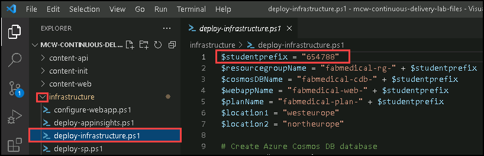
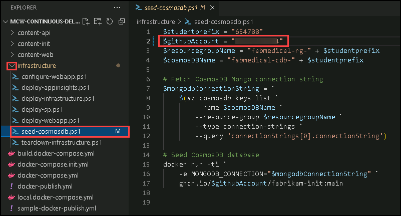
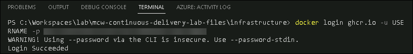
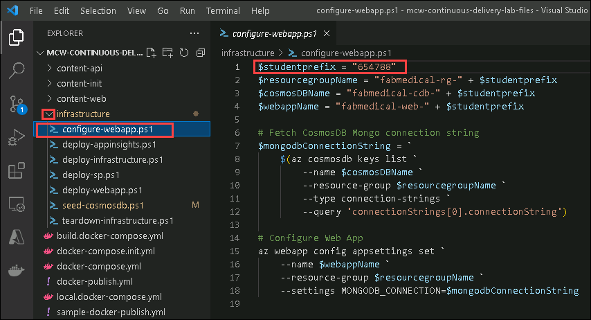

## Exercise 3: Continuous Delivery / Continuous Deployment

Duration: 60 minutes

The Fabrikam Medical Conferences developer workflow has been improved. We are ready to consider migrating from running on-premises to cloud implementation to reduce maintenance costs and facilitate scaling when necessary. We will take steps to run the containerized application in the cloud as well as automate its deployment.

**Help references**

|                                       |                                                                        |
| ------------------------------------- | ---------------------------------------------------------------------- |
| **Description**                       | **Link**                                                              |
| What is Continuous Delivery? | <https://docs.microsoft.com/devops/deliver/what-is-continuous-delivery> |
| Continuous delivery vs. continuous deployment | <https://azure.microsoft.com/overview/continuous-delivery-vs-continuous-deployment/> |
| Microsoft Learn - Introduction to continuous delivery | <https://docs.microsoft.com/learn/modules/introduction-to-continuous-delivery> |


### Task 1: Set up Cloud Infrastructure

 1. In Visual Studio Code, open the `deploy-infrastructure.ps1` PowerShell script in the `infrastructure` folder from Explorer in the VS Code.

     >**Note:** We have already updated the $studentprefix in this file with the required value. 

   ```pwsh
   $studentprefix = "DeploymentID"                                  
   $resourcegroupName = "fabmedical-rg-" + $studentprefix
   $cosmosDBName = "fabmedical-cdb-" + $studentprefix
   $webappName = "fabmedical-web-" + $studentprefix
   $planName = "fabmedical-plan-" + $studentprefix
   $location1 = "westeurope"
   $location2 = "northeurope"
   ```

   

 2. Note the individual calls to the `azcli` for the following:
    
    - Creating a CosmosDB Database

        ```pwsh
        # Create CosmosDB database
        az cosmosdb create `
            --name $cosmosDBName `
            --resource-group $resourcegroupName `
            --locations regionName=$location1 failoverPriority=0 isZoneRedundant=False `
            --locations regionName=$location2 failoverPriority=1 isZoneRedundant=True `
            --enable-multiple-write-locations `
            --kind MongoDB
        ```

    - Creating an Azure App Service Plan

        ```pwsh
        # Create Azure App Service Plan
        az appservice plan create `
            --name $planName `
            --resource-group $resourcegroupName `
            --sku S1 `
            --is-linux
        ```

    - Creating an Azure Web App

        ```pwsh
        # Create Azure Web App with NGINX container
        az webapp create `
            --resource-group $resourcegroupName `
            --plan $planName `
            --name $webappName `
            --deployment-container-image-name nginx
        ```

 3. Open Terminal in **Visual Studio Code** and login to Azure by running the following command. this will open the edge browser, you need to enter the login details below:
   
    
     * Azure Usename/Email: <inject key="AzureAdUserEmail"></inject> 
 
     * Azure Password: <inject key="AzureAdUserPassword"></inject> 
 

    ```pwsh
    az login
    ```

 4. Once the login is completed, navigate back to the terminal and run the `deploy-infrastructure.ps1` with the below command.

    ```pwsh
    cd C:\Workspaces\lab\mcw-continuous-delivery-lab-files\infrastructure
    ./deploy-infrastructure.ps1
    ```
     >**Note:** The **deploy-infrastructure.ps1** script may take up to 10-20 minutes to run. wait until the script runs completely.
   
 5. Browse to the Azure Portal and verify the creation of the resources, CosmosDB instance, the App Service Plan, and the Web App.

     

 6. Open the `seed-cosmosdb.ps1` PowerShell script in the `infrastructure` folder from Explorer in the VS Code and replace your GitHub username in  `$githubAccount = "Your github account name here"` variable. Once the changes are done make sure to save the file.

     >**Note:** We have already updated the $studentprefix in this file with the required value. 

    ```pwsh
    $studentprefix = "deploymentID"
    $githubAccount = "Your github account name here"
    $resourcegroupName = "fabmedical-rg-" + $studentprefix
    $cosmosDBName = "fabmedical-cdb-" + $studentprefix
    ```
   
     

 7. Observe the call to fetch the MongoDB connection string for the CosmosDB database.

    ```pwsh
    # Fetch CosmosDB Mongo connection string
    $mongodbConnectionString = `
        $(az cosmosdb keys list `
            --name $cosmosDBName `
            --resource-group $resourcegroupName `
            --type connection-strings `
            --query 'connectionStrings[0].connectionString')
    ```

 8. Note the call to seed the CosmosDB database using the MongoDB connection string passed as an environment variable (`MONGODB_CONNECTION`) to the `fabrikam-init` docker image we built in the previous exercise using `docker-compose`.

    ```pwsh
    # Seed CosmosDB database
    docker run -ti `
        -e MONGODB_CONNECTION="$mongodbConnectionString" `
        ghcr.io/$githubAccount/fabrikam-init:main
    ```
    
 9.  Before you pull this image, you may need to authenticate with the GitHub Docker registry. To do this, run the following command before you execute the script. Fill the placeholders appropriately. 

     >**Note**: **Username is case sensitive make sure you enter the exact username and personal access token.**

       ```pwsh
       docker login ghcr.io -u USERNAME -p PERSONAL ACCESS TOKEN 
       ```
     

 10. Run the `seed-cosmosdb.ps1` file in terminal using the below command. Browse to the Azure Portal and navigate to **fabmedical-cdb-<inject key="DeploymentID" enableCopy="false" />** Cosmos DB resource and  and verify that the CosmosDB instance has been seeded.

     ```pwsh
     ./seed-cosmosdb.ps1
     ```
       
 11. Once the script execution is completed, Browse to the Azure Portal and navigate to **fabmedical-cdb-<inject key="DeploymentID" enableCopy="false" />** Cosmos DB resource and select **Data Explorer** from the left menu and verify that the CosmosDB instance has been seeded.

     

 12. Below the `sessions` collection, select **Scale & Settings (1)** and **Indexing Policy (2)**.

     

 13. Create a Single Field indexing policy for the `startTime` field (1). Then, select **Save** (2).

     

 14.  Open the `configure-webapp.ps1` PowerShell script in the `infrastructure` folder from Explorer in the VS Code.
   
        **Note:** We have already updated the $studentprefix in this file with the required value. 
     
      ```pwsh
      $studentprefix = "deploymentID"
      $resourcegroupName = "fabmedical-rg-" + $studentprefix
      $cosmosDBName = "fabmedical-cdb-" + $studentprefix
      $webappName = "fabmedical-web-" + $studentprefix
      ```
  
   
  
 15.  observe the call to configure the Azure Web App using the MongoDB connection string passed as an environment variable (`MONGODB_CONNECTION`) to the web application.
   
       ```pwsh
       # Configure Web App
       az webapp config appsettings set `
          --name $webappName `
          --resource-group $resourcegroupName `
          --settings MONGODB_CONNECTION=$mongodbConnectionString
       ```

 16. Run the `configure-webapp.ps1` file in terminal using the below command.

      ```pwsh
      cd C:\Workspaces\lab\mcw-continuous-delivery-lab-files\infrastructure
      ./configure-webapp.ps1
      ```

 17. Once the script execution is completed, Browse to the Azure Portal and search for **fabmedical-web-<inject key="DeploymentID" enableCopy="false" />** App service and select **Configuration** from the left side menu and verify that the environment variable `MONGODB_CONNECTION` has been added to the Azure Web Application settings.

     

### Task 2: Deployment Automation to Azure Web App

 1. Take the GitHub Personal Access Token you obtained in the Before the Hands-On Lab guided instruction and assign it to the `CR_PAT` environment variable in PowerShell. We will need this environment variable for the `deploy-webapp.ps1` PowerShell script, but we do not want to add it to any files that may get committed to the repository since it is a secret value.

    ```pwsh
    $env:CR_PAT="<GitHub Personal Access Token>"
    ```
 1. Open the `deploy-webapp.ps1` PowerShell script in the `infrastructure` folder from Explorer in VS Code and add your GitHub account username for the `$githubAccount` variable on the second line. Once the changes are done make sure to save the file. 

    >**Note:** We have already updated the $studentprefix in this file with the required value. 

    ```pwsh
    $studentprefix = "deploymentID"                                 
    $githubAccount = "GitHub account username"                           # <-- Modify this value
    $resourcegroupName = "fabmedical-rg-" + $studentprefix
    $webappName = "fabmedical-web-" + $studentprefix
    ```

   

 1. Note the call to deploy the Azure Web Application using the `docker-compose.yml` file we modified in the previous exercise.

    ```pwsh
    # Deploy Azure Web App
    az webapp config container set `
        --docker-registry-server-password $env:CR_PAT `
        --docker-registry-server-url https://ghcr.io `
        --docker-registry-server-user $githubAccount `
        --multicontainer-config-file ./../docker-compose.yml `
        --multicontainer-config-type COMPOSE `
        --name $webappName `
        --resource-group $resourcegroupName
    ```

 1. Run the `deploy-webapp.ps1` file in terminal using the below command.

     ```pwsh
     ./deploy-webapp.ps1
     ```

    > **Note**: Make sure to run the `deploy-webapp.ps1` script from the `infrastructure` folder

 1. Browse to the Azure Portal and verify that the Azure Web Application is running by checking the `Log stream` blade of the Azure Web Application detail page.

    

 1. Browse to the `Overview` blade of the Azure Web Application detail page and find the web application URL. Browse to that URL to verify the deployment of the web application. It might take a few minutes for the web application to reflect new changes.

    
   
    >**Note:** If you see any nginx error while browsing the App URL, that's fine as it will take a few minutes to reflect the changes.
    
    
    

### Task 3: Continuous Deployment with GitHub Actions

With the infrastructure in place, we can set up continuous deployment with GitHub Actions.

 1. Go to Environment details click on **Service principle Credentials** copy **Application id(clientId)** , **clientSecret** , **subscriptionId** and **tenantId** 
    
     
    
    Replace the values that you copied in the below Json.
     ```pwsh
     {
         "clientId": "...",
         "clientSecret": "...",
         "subscriptionId": "...",
         "tenantId": "...",
         "activeDirectoryEndpointUrl": "https://login.microsoftonline.com",
         "resourceManagerEndpointUrl": "https://management.azure.com/",
         "activeDirectoryGraphResourceId": "https://graph.windows.net/",
         "sqlManagementEndpointUrl": "https://management.core.windows.net:8443/",
         "galleryEndpointUrl": "https://gallery.azure.com/",
         "managementEndpointUrl": "https://management.core.windows.net/"
     }
     ```
    Copy the complete JSON output to your clipboard.

 1. In your GitHub lab files repository, navigate to the `Secrets` > `Actions` blade in the `Settings` tag and create a new repository secret named `AZURE_CREDENTIALS`. Paste the JSON output copied in the previous step to the secret value and click on `Add secret`.

     
   
 1. Edit the `docker-publish.yml` file in the `.github\workflows` folder using Github. Add the job present in the file URL mentioned below to the end of the `docker-publish.yml` file.

    > **Note**: Make sure to change the student prefix with **Deployment ID** for the last action in the `deploy` job. **Deployment ID** value can be found in Environment details page.
    
    `https://raw.githubusercontent.com/CloudLabs-MCW/MCW-Continuous-delivery-in-Azure-DevOps/prod/Hands-on%20lab/deploy-job.yml`
    
    
    
 1. Commit the YAML file to your `main` branch. A GitHub action should begin to execute for the updated workflow.

    > **Note**: Make sure that your Actions workflow file does not contain any syntax errors, which may appear when you copy and paste. They are highlighted in the editor or when the Action tries to run, as shown below.

    

 1. Observe that the action builds the docker images, pushes them to the container registry, and deploys them to the Azure web application.

     

 1. Run the below command to perform a `git pull` on your local repository folder to fetch the latest changes from GitHub.
 
     ```BASH
     git pull
     ```
1. Click on the **Next** button present in the bottom-right corner of this lab guide.  

