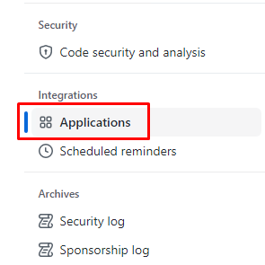

## Exercise 3: Monitoring, Logging, and Continuous Deployment with Azure

Duration: 40 minutes

Fabrikam Medical Conferences has its first website for a customer running in the cloud, but deployment is still a largely manual process, and we have no insight into the behavior of the application in the cloud. In this exercise, we will add monitoring and logging to gain insight into the application usage in the cloud. Then, we will disable the GitHub pipeline and show how to build a deployment pipeline in Azure DevOps.

### Task 1: Set up Application Insights

1. Run the below-mentioned command to deploy the app insights, make sure that you are in the correct directory:

    ```
    ./deploy-appinsights.ps1
    ```
    
1. Now save the `AI Instrumentation Key` specified in the output - we will need it for a later step.

    ```bash
    The installed extension 'application-insights' is in preview.
    AI Instrumentation Key="55cade0c-197e-4489-961c-51e2e6423ea2"
    ```

1. Using PowerShell navigate to the `./content-web` folder in your GitHub lab files repository by running the below-mentioned command.

   ```
   cd ..
   cd .\content-web
   
   ```
   
1. Now using PowerShell, execute the following command to install JavaScript support for Application Insights via NPM to the web application frontend.

    ```bash
    npm install applicationinsights --save
    ```

1. Modify the file `./content-web/app.js` to reflect the following to add and configure Application Insights for the web application frontend in the local folder. You can use `code app.js` command in Powershell to open and modify the file.

   >**Note**: Make sure to save the `app.js` file after modifying the content.

    ```js
    const express = require('express');
    const http = require('http');
    const path = require('path');
    const request = require('request');

    const app = express();

    const appInsights = require("applicationinsights");         // <-- Add these lines here
    appInsights.setup("UPDATE AI Instrumentation Key");  // <-- Make sure AI Inst. Key matches
    appInsights.start();                                        // <-- key from step 2.

    app.use(express.static(path.join(__dirname, 'dist/content-web')));
    const contentApiUrl = process.env.CONTENT_API_URL || "http://localhost:3001";

    ...
    ```

1. Add and commit changes to your GitHub lab-files repository. From the root of the repository, execute the following:

    ```pwsh
    git add .
    git commit -m "Added Application Insights"
    git push
    ```

1. Wait for the GitHub Actions for your lab files repository to complete before executing the next step.

      

1. Redeploy the web application by running the below commands:

    ```
    cd C:\Workspaces\lab\mcw-continuous-delivery-lab-files\infrastructure
    ./deploy-webapp.ps1
    ```
    
1. Visit the deployed website and check Application Insights in the Azure Portal to see instrumentation data.

### Task 2: Create Azure DevOps Personal Access Token

1. In your LabVM, open a new tab in the browser then copy and paste the below mentioned link.

    ```pwsh
    https://dev.azure.com/
    ```
1. On the **Azure Devops** page, click on **Sign in to Azure Devops**. 

    
    
1. On **We need few more details page**, leave everything as default and click on **Continue**.

    
    
1. On the home page of Azure Devops, select the existing organization named aiw-devops and select **Fabrikam-<inject key="DeploymentID" enableCopy="false" />** project.
    
   

1. Click on the **User settings** at the top right corner of the page and then select **Personal Access Tokens**.
   
   
   
1. Now on the **Personal Access Tokens** page, click on **+ New Token**   
   
   
   
1. In the Create a new personal access token page enter the following details:
   
   - **Name**: Enter **mcw-continuous-delivery** 

   - **Organization**: Leave as **Default**

   - **Expiration** : Leave as **Default**

   - **Scopes**: Full access

   - Click on **Create**

   
   
1. Copy the value of the generated token and save it in the notepad where you have stored the GitHub Personal Access Token then click on **Close**.

   
   
1. Keep this Personal Access token safe for later use. **DO NOT COMMIT THIS TO YOUR REPO!**


### Task 3: Connect Azure Board with GitHub

We can automate our project tracking with the Azure Board integration for GitHub. In this task, you will connect your Azure DevOps project's board to your GitHub repository.

1. In your browser open GitHub Marketplace by navigating to the below URL:

    ``` 
    https://github.com/marketplace/azure-boards
    ```

    

2. Scroll to the bottom of the page and select `Install it for Free`.

   

3. On the next page, select **Complete order and begin installation**.

4. Select the lab files repository `mcw-continuous-delivery-lab-files` which you created earlier.

   
    
   >**Note**: If you see the message **You’ve already purchased this on all of your GitHub accounts** this indicates Azure Boards integration is already used in your account, follow the below steps.
   
   - In the upper-right corner of your GitHub page, click your profile photo, then click **Settings** and in the left sidebar click **Application** under **Integrations**.
   
   
   
      
   
   - In the Applications tab, select **Configure** next to **Azure Boards** under Installed GitHub Apps.

     
     
   - Scroll down to **Repository access** in **Azure Boards** pane, then **Check** the **Only select repositories**. From the **Select repositories** drop-down search for **mcw-continuous-delivery-lab-files** and select the repositiory. Click on **Save**.

     
    
5. Select the **aiw-devops** Azure DevOps organization and select the Fabrikam project then click on **Continue**

    

6. When the integration succeeds, you will be taken to the Azure DevOps Board. In the onboarding tutorial click on **Create** to create an initial Issue in the `To Do` Column.

    
    
7. Now click on **Create and link a pull request** to create a pull request associated with your Issue.

    

8. Open the new Issue that the onboarding tutorial creates and observe the GitHub pull request and comments that are linked to the Azure DevOps board Issue.

    

9. In GitHub, browse to the `Pull Requests` tab of the lab files repository created in [Task 1 of the Before the HOL Instructions] and open the pull request that was created in the onboarding tutorial for the Azure Boards Integration App. Note the `AB#1` annotation in the pull request comments - this annotation signals to Azure DevOps that this pull request comment should be linked to Issue #1 in Azure Boards.

    

10. Select the `Files changed` tab within the pull request detail and observe the change to the README.md associated with this pull request. After reviewing the changes, go back to the `Conversation` tab and select the `Merge pull request` button and confirm the following prompt to merge the pull request into the `main` branch.

    

11. In Azure DevOps Boards, find the work item and observe that the issue has been moved to the `Done` column on completion of the pull request.

    


### Task 4: Linking Git commits to Azure DevOps issues

In this task, you will create an issue in Azure DevOps and link a Git pull request from GitHub to the Azure DevOps issue. This uses the Azure Boards integration that was set up in the Before Hands-on Lab.

1. Navigate to 'dev.azure.com' and select boards under **Boards** and click on **New item**.

     

2. Update the value as **Update README.md** in Azure Boards.

     

1. Using PowerShell create a branch from `main` and name it `feature/update-readme` by executing the commands mentioned below.

    ```pwsh
    git checkout main
    git checkout -b feature/update-readme  # <- This creates the branch and checks it out    
    ```    

1. Commit the change, and push it to GitHub.

    ```pwsh
    git commit -m "README.md update"
    git push --set-upstream origin feature/update-readme
    ```
1. Using Github, manually make a small change (for ex: add an extra blank line at the end) to README.md in the `feature/update-readme` branch.  

     

1. Create a pull request to merge `feature/update-readme` into `main` in GitHub. Add the annotation `AB#YOUR_ISSUE_NUMBER_FROM_STEP_4` in the description of the pull request to link the GitHub pull request with the new Azure Boards issue in step 4. For example, if your issue number is 2, then your annotation in the pull request description should include `AB#2`. 

    > **Note**: The `Docker` build workflow executes as part of the status checks.

     

1. Select the `Merge pull request` button after the build completes successfully to merge the Pull Request into `main`.

    

    > **Note**: Under normal circumstances, this pull request would be reviewed by someone other than the author of the pull request. For now, use your administrator privileges to force the merge of the pull request.

1. Observe in Azure Boards that the Issue is appropriately linked to the GitHub comment.

    

### Task 3: Continuous Deployment with Azure DevOps Pipelines

> **Note**: This section demonstrates Continuous Deployment via ADO pipelines, which is equivalent to the Continuous Deployment via GitHub Actions demonstrated in Task 2. For this reason, disabling GitHub action here is critical so that both pipelines (ADO & GitHub Actions) don't interfere with each other.
> **Note**: To complete [Exercise 3: Task 3](#task-3-continuous-deployment-with-azure-devops-pipelines), the student will need to request a free grant of parallel jobs in Azure Pipelines via [this form](https://aka.ms/azpipelines-parallelism-request). More information can be found [here regarding changes in Azure Pipelines Grant for Public Projects](https://devblogs.microsoft.com/devops/change-in-azure-pipelines-grant-for-public-projects/)

1. Disable your GitHub Actions by adding the `branches-ignore` property to the existing `docker-publish.yml` workflow in your lab files repository (located under the `.github/workflows` folder).

    ```pwsh
    on:
      push:
        branches-ignore:    # <-- Add this list property
          - '**'            # <-- with '**' to disable all branches
    ```
    
   

1. Navigate to your Azure DevOps `Fabrikam` project, select the `Project Settings` blade, and open the `Service Connections` tab.

   
   
1. Click on **Create Service Connection**.

   
   
1. On the New Service Connection tab, search for Docker and select **Docker Registry**, then click on **Next**.

   

1. Create a new `Docker Registry` service connection and set the values to:

    - Docker Registry: `https://ghcr.io`
    - Docker ID: [GitHub account name]
    - Docker Password: [GitHub Personal Access Token]
    - Service connection name: GitHub Container Registry
    - Click on **Save**

    

1. Navigate to your Azure DevOps `Fabrikam` project, select the `Pipelines` blade, and click on **Create pipeline**.

    

1. In the `Connect` tab, choose the `GitHub` selection.

    

1. Select your GitHub lab files repository.  Azure DevOps will redirect you to authorize yourself with GitHub. Log in and select the repository that you want to allow Azure DevOps to access.

     

1. In the `Configure` tab, choose the `Starter Pipeline`.

    

1. Remove all the steps from the YAML. The empty pipeline should look like the following:

    ```yaml
    # Starter pipeline
    # Start with a minimal pipeline that you can customize to build and deploy your code.
    # Add steps that build, run tests, deploy, and more:
    # https://aka.ms/yaml

    trigger:
    - main

    pool:
      vmImage: ubuntu-latest

    steps:
    ```

1. Click on **Show assistant** to view the sidebar, find the `Docker Compose` task, and configure it with the following fields:

    - Container Registry Type: Container Registry
    - Docker Registry Service Connection: GitHub Container Registry (created in step 3)
    - Docker Compose File: **/docker-compose.yml
    - Additional Docker Compose Files: build.docker-compose.yml
    - Action: Build Service Images
    - Additional Image Tags = $(Build.BuildNumber)
    - Click on **Add**

    
    
    

1. Repeat step 9 and add another `Docker Compose` task and configure it with the following fields:

    - Container Registry Type: Container Registry
    - Docker Registry Service Connection: GitHub Container Registry (created in step 3)
    - Docker Compose File: **/docker-compose.yml
    - Additional Docker Compose Files: build.docker-compose.yml
    - Action: Push Service Images
    - Additional Image Tags = $(Build.BuildNumber)
    - Click on **Add**

    
    
1. The final file should be similar to the one below:
    
    

1. Now click on Save and run from the right corner to run the build. New docker images will be built and pushed to the GitHub package registry.

    
    
1. On Save and run page, leave everything as default and click on **Save and run**.

     
     
1. You will be prompted with a Warning to grant permissions for the pipeline, click on **View**.

     
     
1. On the Waiting for review page, click on **Permit** to grant permissions.

     
     
1. Navigate to your `Fabrikam` project in Azure DevOps and select the `Project Settings` blade. From there, select the `Service Connections` tab.

1. On the **Service Connections** page, click on **New service connection**.

     
    
1. Select  `Azure Resource Manager` and click on **Next**.

1. On the new service connection tab choose **Service Principal (manual)** and select **Next**

    

1. Enter your subscription ID, Name and get the Service Principal details from **Environment Details -> Service Principal** details tab and then Service Connection name to **Fabrikam-Azure**. The value of the Service Principal Id is the same as the Application Id and the Service Principal Key value is the same as the Secret key. Once done click on verify and the Save.
 
   >**Note**: You can get the subscription name from the Azure portal -> Subscriptions.

1. Navigate to Pipelines and select the pipeline you create in the last step and click `Edit` mode, and then select the `Variables` button on the top-right corner of the pipeline editor. 

    
    
    

1. Add a secret variable `CR_PAT`, check the `Keep this value secret` checkbox, and copy the GitHub Personal Access Token from the Before the Hands-on lab guided instruction into the `Value` field. Save the pipeline variable - we will reference it in a later step.

    

1. Modify (replace) the build pipeline YAML to split into a build stage and a deploy stage, as follows. Make sure to replace **arguments** value with **<inject key="Deploymentid" />**, once done save the pipeline.
 

    ```yaml
    # Starter pipeline
    # Start with a minimal pipeline that you can customize to build and deploy your code.
    # Add steps that build, run tests, deploy, and more:
    # https://aka.ms/yaml

    trigger:
    - main

    pool:
      vmImage: ubuntu-latest

    stages:
    - stage: build
      jobs:
      - job: 'BuildAndPublish'
        displayName: 'Build and Publish'
        steps:
        - task: DockerCompose@0
          inputs:
            containerregistrytype: 'Container Registry'
            dockerRegistryEndpoint: 'GitHub Container Registry'
            dockerComposeFile: '**/docker-compose.yml'
            additionalDockerComposeFiles: 'build.docker-compose.yml'
            action: 'Build services'
            additionalImageTags: '$(Build.BuildNumber)'
        - task: DockerCompose@0
          inputs:
            containerregistrytype: 'Container Registry'
            dockerRegistryEndpoint: 'GitHub Container Registry'
            dockerComposeFile: '**/docker-compose.yml'
            additionalDockerComposeFiles: 'build.docker-compose.yml'
            action: 'Push services'
            additionalImageTags: '$(Build.BuildNumber)'    

    - stage: DeployProd
      dependsOn: build
      jobs:
      - deployment: webapp
        environment: production
        strategy:
          runOnce:
            deploy:
              steps:
              - checkout: self

              - powershell: |
                  (gc .\docker-compose.yml) `
                    -replace ':latest',':$(Build.BuildNumber)' | `
                    set-content .\docker-compose.yml
                    
              - task: AzureCLI@2
                inputs:
                  azureSubscription: 'Fabrikam-Azure' # <-- The service
                  scriptType: 'pscore'                # connection from step 14
                  scriptLocation: 'scriptPath'
                  scriptPath: './infrastructure/deploy-webapp.ps1'
                  workingDirectory: ./infrastructure
                  arguments: 'deploymentID'         # <-- This should be your custom
                env:                       # lowercase three character 
                  CR_PAT: $(CR_PAT)  # prefix from an earlier exercise.
                                # ^^^^^^
                                # ||||||
                                # The pipeline variable from step 15
    ```

1. Navigate to the `Environments` category with the `Pipelines` blade in the `Fabrikam` project and select the `production` environment.

    

1. From the vertical ellipsis menu button in the top-right corner, select `Approvals`.

    

1. Add an `Approvals` check.  Add your account as an `approvals` and create the check.

    
    
    
    
1. Now go back to the Pipeline and run the build pipeline.

1. Run the build pipeline and note how the pipeline waits before moving to the `DeployProd` stage. You will need to approve the request before the `DeployProd` stage runs.

    
    
1. You will be prompted with a Warning to grant permissions for the pipeline, click on **View**.

     
     
1. On the Waiting for review page, click on **Permit** for both **Service Connection** and **Environment**.

     
  
1. Now click on the Review button and click **Approve** button to start the DeployProd stage in the pipeline

     
     
     

Congratulation, You have completed this workshop.
-------
    
