<div class="MCWHeader1">
Continuous delivery in Azure DevOps and Azure
</div>

<div class="MCWHeader2">
Hands-on lab step-by-step
</div>

<div class="MCWHeader3">
January 2019
</div>

Information in this document, including URL and other Internet Web site references, is subject to change without notice. Unless otherwise noted, the example companies, organizations, products, domain names, e-mail addresses, logos, people, places, and events depicted herein are fictitious, and no association with any real company, organization, product, domain name, e-mail address, logo, person, place or event is intended or should be inferred. Complying with all applicable copyright laws is the responsibility of the user. Without limiting the rights under copyright, no part of this document may be reproduced, stored in or introduced into a retrieval system, or transmitted in any form or by any means (electronic, mechanical, photocopying, recording, or otherwise), or for any purpose, without the express written permission of Microsoft Corporation.

Microsoft may have patents, patent applications, trademarks, copyrights, or other intellectual property rights covering subject matter in this document. Except as expressly provided in any written license agreement from Microsoft, the furnishing of this document does not give you any license to these patents, trademarks, copyrights, or other intellectual property.

The names of manufacturers, products, or URLs are provided for informational purposes only and Microsoft makes no representations and warranties, either expressed, implied, or statutory, regarding these manufacturers or the use of the products with any Microsoft technologies. The inclusion of a manufacturer or product does not imply endorsement of Microsoft of the manufacturer or product. Links may be provided to third party sites. Such sites are not under the control of Microsoft and Microsoft is not responsible for the contents of any linked site or any link contained in a linked site, or any changes or updates to such sites. Microsoft is not responsible for webcasting or any other form of transmission received from any linked site. Microsoft is providing these links to you only as a convenience, and the inclusion of any link does not imply endorsement of Microsoft of the site or the products contained therein.

© 2018 Microsoft Corporation. All rights reserved.

Microsoft and the trademarks listed at https://www.microsoft.com/en-us/legal/intellectualproperty/Trademarks/Usage/General.aspx are trademarks of the Microsoft group of companies. All other trademarks are property of their respective owners.

**Contents**
<!-- TOC -->

- [Continuous delivery in Azure DevOps and Azure hands-on lab step-by-step](#continuous-delivery-in-azure-devops-and-azure-hands-on-lab-step-by-step)
  - [Abstract and learning objectives](#abstract-and-learning-objectives)
  - [Overview](#overview)
  - [Solution architecture](#solution-architecture)
  - [Requirements](#requirements)
  - [Exercise 1: Create an Azure Resource Manager (ARM) template that can provision the web application, SQL database, and deployment slots in a single automated process](#exercise-1-create-an-azure-resource-manager-arm-template-that-can-provision-the-web-application-sql-database-and-deployment-slots-in-a-single-automated-process)
    - [Task 1: Create an Azure Resource Manager (ARM) template using Visual Studio](#task-1-create-an-azure-resource-manager-arm-template-using-visual-studio)
    - [Task 2: Add an Azure SQL database and server to the template](#task-2-add-an-azure-sql-database-and-server-to-the-template)
    - [Task 3: Add a web hosting plan and web app to the template](#task-3-add-a-web-hosting-plan-and-web-app-to-the-template)
    - [Task 4: Add Application Insights to the template](#task-4-add-application-insights-to-the-template)
    - [Task 5: Configure automatic scale for the web app in the template](#task-5-configure-automatic-scale-for-the-web-app-in-the-template)
    - [Task 6: Configure the list of release environments parameters](#task-6-configure-the-list-of-release-environments-parameters)
    - [Task 7: Configure the name of the web app using the environments parameters](#task-7-configure-the-name-of-the-web-app-using-the-environments-parameters)
    - [Task 8: Add a deployment slot for the "staging" version of the site](#task-8-add-a-deployment-slot-for-the-%22staging%22-version-of-the-site)
    - [Task 9: Create the dev environment and deploy the template to Azure](#task-9-create-the-dev-environment-and-deploy-the-template-to-azure)
    - [Task 10: Create the test environment and deploy the template to Azure](#task-10-create-the-test-environment-and-deploy-the-template-to-azure)
    - [Task 11: Create the production environment and deploy the template to Azure](#task-11-create-the-production-environment-and-deploy-the-template-to-azure)
  - [Exercise 2: Create Visual Studio Team Services team project and Git Repository](#exercise-2-create-visual-studio-team-services-team-project-and-git-repository)
    - [Task 1: Create Visual Studio Team Services Account](#task-1-create-visual-studio-team-services-account)
    - [Task 2: Add the Tailspin Toys source code repository to Azure DevOps](#task-2-add-the-tailspin-toys-source-code-repository-to-azure-devops)
  - [Exercise 3: Create Azure DevOps build definition](#exercise-3-create-azure-devops-build-definition)
    - [Task 1: Create a build definition](#task-1-create-a-build-definition)
    - [Task 2: Enable continuous integration](#task-2-enable-continuous-integration)
  - [Exercise 4: Create Azure DevOps release pipeline](#exercise-4-create-azure-devops-release-pipeline)
    - [Task 1: Create a release definition](#task-1-create-a-release-definition)
    - [Task 2: Add test and production environments to release definition](#task-2-add-test-and-production-environments-to-release-definition)
  - [Exercise 5: Trigger a build and release](#exercise-5-trigger-a-build-and-release)
    - [Task 1: Manually queue a new build and follow it through the release pipeline](#task-1-manually-queue-a-new-build-and-follow-it-through-the-release-pipeline)
  - [Exercise 6: Create a feature branch and submit a pull request](#exercise-6-create-a-feature-branch-and-submit-a-pull-request)
    - [Task 1: Create a new branch](#task-1-create-a-new-branch)
    - [Task 2: Make a code change to the feature branch](#task-2-make-a-code-change-to-the-feature-branch)
    - [Task 3: Submit a pull request](#task-3-submit-a-pull-request)
    - [Task 4: Approve and complete a pull request](#task-4-approve-and-complete-a-pull-request)
  - [After the hands-on lab](#after-the-hands-on-lab)
    - [Task 1: Delete resources](#task-1-delete-resources)

<!-- /TOC -->

# Continuous delivery in Azure DevOps and Azure hands-on lab step-by-step

## Abstract and learning objectives 

In this hands-on lab, you will learn how to implement a solution with a combination of Azure Resource Manager templates and Azure DevOps to enable continuous delivery with several Azure PaaS services.

At the end of this workshop, you will be better able to implement solutions for continuous delivery with Azure DevOps in Azure, as well create an Azure Resource Manager (ARM) template to provision Azure resources, configure continuous delivery with Azure DevOps, configure Application Insights into an application, and create an Azure DevOps project and Git repository.

## Overview

Tailspin Toys has asked you to automate their development process in two specific ways. First, they want you to define an Azure Resource Manager template that can deploy their application into the Microsoft Azure cloud using Platform-as-a-Service technology for their web application and their SQL database. Second, they want you to implement a continuous delivery process that will connect their source code repository into the cloud, automatically run their code changes through unit tests, and then automatically create new software builds and deploy them onto environment-specific deployment slots so that each branch of code can be tested and accessed independently.

## Solution architecture

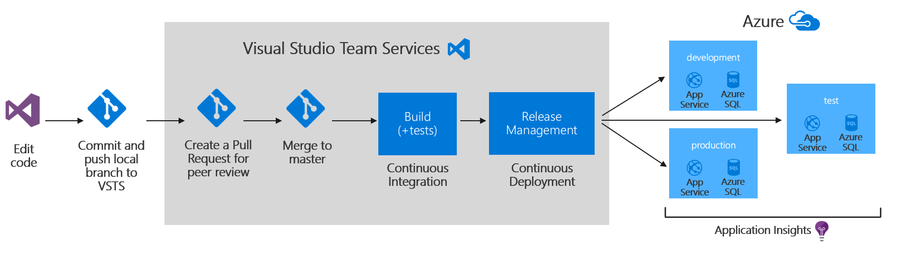

## Requirements

1.  Microsoft Azure subscription.

2.  Local machine or a virtual machine configured with:

    -   Visual Studio Community 2017

    -   Git command-line interface (CLI)

## Exercise 1: Create an Azure Resource Manager (ARM) template that can provision the web application, SQL database, and deployment slots in a single automated process

Duration: 45 Minutes

Tailspin Toys has requested three Azure environments (dev, test, production), each consisting of the following resources:

-   App Service

    -   Web App

        -   Auto-scale rule

    -   Deployment slots (for zero-downtime deployments)

-   SQL Server

    -   SQL Database

-   Application Insights

Since this solution is based on Azure Platform-as-a-Service (PaaS) technology, it should take advantage of that platform by utilizing automatic scale for the web app and the SQL Database PaaS service instead of SQL Server virtual machines.

### Task 1: Create an Azure Resource Manager (ARM) template using Visual Studio

1.  Open Visual Studio and create a new project of the type Cloud -- Azure Resource Group. Name the new project "TailspinToys.AzureResourceTemplate" and save it to **C:\\Hackathon**. Also, make sure that both check boxes are checked on the lower right, as in the screen shot below. When finished, click **OK**.
    
    

2.  On the next window, click **Blank Template**, and click **OK**.
    
    

3.  In the Solution Explorer window, open the azuredeploy.json file by double-clicking it.
    
    

4.  Then, probably on the left side of the Visual Studio window, open the window called JSON Outline. It will look like this screen shot:
    
    

5.  Save your files.

### Task 2: Add an Azure SQL database and server to the template

1.  Right-click on the **resources** item in the **JSON Outline** and click **Add New Resource**.
    
    

2.  Select **SQL Server** and give it a name like "tailspinsql", then click **Add**.

    

3.  Now that the SQL Server has been created as a resource, right-click that SQL Server resource and choose **Add New Resource** so that you can add a database.
    
    

4.  Choose SQL Database, and call it "TailspinData." Make sure that your server is selected in the drop-down list below, and click **Add**.
    
    

### Task 3: Add a web hosting plan and web app to the template

1.  Add another resource, this time choose **App Service Plan**, and call it "TailspinToysHostingPlan", followed by clicking **Add**.
    
    

2.  Right-click the hosting plan resource and add a new resource underneath it.
    
    

3.  Choose **Web App**, name it "TailspinToysWeb", make sure your hosting plan is selected in the drop-down list, and then click **Add**.
    
    

### Task 4: Add Application Insights to the template

1.  Add a new resource to the template, this time choose **Application Insights for Web Apps**. Make sure your correct hosting plan and web app are selected in the boxes. Name the Application Insights resource "TailspinToysWeb" and then click **Add**.
    
    

2.  Next, you need to add the Application Insights extension to the App Service so that it will be running automatically once the site is deployed. This is going to require some manual code because there is not a wizard for this resource type. Click on the TailspinToysWeb web app resource to locate its JSON code. Then, just below the "properties" property, paste or type in this block of JSON code.
    ```
    "resources": [
        {
        "apiVersion": "2015-08-01",
        "name": "Microsoft.ApplicationInsights.AzureWebSites",
        "type": "siteextensions",
        "tags": {
            "displayName": "Application Insights Extension"
        },
        "dependsOn": [
            "[resourceId('Microsoft.Web/Sites/', variables('TailspinToysWebName'))]",
            "[resourceId('Microsoft.Insights/components/', 'TailspinToysWeb')]"
        ],
        "properties": {
        }
        }
    ]
    ```

    It will look something like this screen shot:

    

### Task 5: Configure automatic scale for the web app in the template

1.  Click on the resource called "TailspinToysWeb AutoScale" to see its JSON value.
    
    

2.  In the main window, scroll down a little to find the "enabled" property of the auto scale rule. Change it from "false" to "true." You can examine the other settings in this JSON value to understand the setting. It defaults to increasing the instance count if the CPU goes above 80% for a while and reduces the instance count if the CPU falls below 60% for a while.
    
    

### Task 6: Configure the list of release environments parameters

1.  Next, you need to configure the list of release environments we'll be deploying to. Our scenario calls for adding three environments: dev, test, and production. This is going to require some manual code because there is not a wizard for this resource type. Click on the parameters item in the JSON Outline window to locate its JSON code. Then, add this code as the first element inside the of the "parameters" object.
    ```
    "environment": {
          "type": "string",
          "defaultValue": "dev",
          "allowedValues": [
            "dev",
            "test",
            "production"
          ]
    },
    ```

    After adding the code, it will look like this:

    

### Task 7: Configure the name of the web app using the environments parameters

1.  Next, you need to configure the template so that it dynamically generates the name of the web application based on the environment it is being deployed to. Click on the variables item in the JSON Outline window to locate its JSON code. Then, location the "variables" section and replace the corresponding TailspinToysWebName value with the following code:

    ```
        "TailspinToysWebName": "[concat('TailspinToysWeb', '-', parameters('environment'), '-', uniqueString(resourceGroup().id))]"},
    ```

    After adding the code, it will look like this:

    

### Task 8: Add a deployment slot for the "staging" version of the site

1.  Next, you need to add the "staging" deployment slot to the web app. This is used during a deployment to stage the new version of the web app. This is going to require some manual code because there is not a wizard for this resource type. Click on the TailspinToysWeb web app resource to locate its JSON code. Then, add this code to the "resources" array, just below the element for the application insights extension.

    ```
    {
        "apiVersion": "2015-08-01",
        "name": "staging",
        "type": "slots",
        "tags": {
        "displayName": "Deployment Slot: staging"
        },
        "location": "[resourceGroup().location]",
        "dependsOn": [
        "[resourceId('Microsoft.Web/Sites/', variables('TailspinToysWebName'))]"
        ],
        "properties": {
        },
        "resources": []
    }
    ```
    It will look something like this screen shot:

    

### Task 9: Create the dev environment and deploy the template to Azure

1.  First, before you deploy the template, you need to make sure that you can get the instrumentation key from the Application Insights resource because you will need it later. To do this, you can add an output property to the template. Go the "outputs" area of the template and paste or type in this JSON code.

    ```
        "MyAppInsightsInstrumentationKey": {
            "value": "[reference(resourceId('Microsoft.Insights/components', 'TailspinToysWeb'), '2014-04-01').InstrumentationKey]",
            "type": "string"
            }
    ```
2.  Now, save all your files.

3.  Right-click the project in Solution Explorer and choose "Deploy" and then "New...."

    

4.  Sign in to your Azure account if necessary, and then choose your correct subscription. Under Resource group, choose "Create New..." and create a new resource group for this deployment. Since we are creating a dev environment, let us name it "TailspinToys-dev." Choose a location near you.
  
    
    
    

5.  Once you have the resource group created, click the **Edit Parameters** button.

    

6.  In the next window, select "dev" from the list of environments. Then, pick an admin username, and password for the database, it does not matter what you choose. Then use "TailspinData" for the TailspinDataName value. Call the hosting plan "TailspinHostingPlan1" and choose "S1" for the Sku. Finally, be sure to check the "Save passwords..." option at the bottom See this screen shot for help. When finished, click Save.
    
    

7.  Then, click the **Deploy** button on the deployment window.
    
    

8.  If we have done everything correct, the deployment will begin. You can watch the output window inside Visual Studio to follow along. This deployment typically takes a few minutes. Upon completion, you should see success and you should see an instrumentation key be written out in the output window. Copy this down for a future step in this process. 

>**Note:** Your key will be different from the one shown in this screen shot.
    
   

### Task 10: Create the test environment and deploy the template to Azure

The following steps are very similar to what was done in the previous task with the exception that you are now creating the test environment

1.  Right-click the project in Solution Explorer and choose "Deploy" and then "New..."

    

2.  Sign in to your Azure account if necessary, and then choose your correct subscription. Under Resource group, choose "Create New..." and create a new resource group for this deployment. Since we are creating a test environment, let us name it "TailspinToys-test." Choose a location near you.

    
    
    

3.  Once you have the resource group created, click the **Edit Parameters** button.

    

4.  In the next window, select "test" from the list of environments. Then, pick an admin username, and password for the database, it does not matter what you choose. Then use "TailspinData" for the TailspinDataName value. Call the hosting plan "TailspinHostingPlan1" and choose "S1" for the Sku. Finally, be sure to check the "Save passwords..." option at the bottom See this screen shot for help. When finished, click Save.

    

5.  Then, click the **Deploy** button on the deployment window.

    

6.  If we have done everything correct, the deployment will begin. You can watch the output window inside Visual Studio to follow along. This deployment typically takes a few minutes. Upon completion, you should see success and you should see an instrumentation key be written out in the output window. Copy this down for a future step in this process. 

>**Note:** Your key will be different from the one shown in this screen shot.

   

### Task 11: Create the production environment and deploy the template to Azure

The following steps are very similar to what was done in the previous task with the exception that you are now creating the production environment.

1.  Right-click the project in Solution Explorer and choose "Deploy" and then "New..."

    

2.  Sign in to your Azure account if necessary, and then choose your correct subscription. Under Resource group, choose "Create New..." and create a new resource group for this deployment. Since we are creating a production environment, let us name it "TailspinToys-prod." Choose a location near you.

    
    
    

3.  Once you have the resource group created, click the **Edit Parameters** button.

    

4.  In the next window, select "production" from the list of environments. Then, pick an admin username, and password for the database, it does not matter what you choose. Then use "TailspinData" for the TailspinDataName value. Call the hosting plan "TailspinHostingPlan1" and choose "S1" for the Sku. Finally, be sure to check the "Save passwords..." option at the bottom See this screen shot for help. When finished, click Save.

    

5.  Then, click the **Deploy** button on the deployment window.
    
    

6.  If we have done everything correct, the deployment will begin. You can watch the output window inside Visual Studio to follow along. This deployment typically takes a few minutes. Upon completion, you should see success and you should see an instrumentation key be written out in the output window. Copy this down for a future step in this process. 

>**Note:** Your key will be different from the one shown in this screen shot.
    
   

7.  If you visit the Azure Portal for your Azure subscription, you should now see the three newly created resource groups.

    

## Exercise 2: Create Visual Studio Team Services team project and Git Repository

Duration: 15 Minutes

In this exercise, you will create and configure a Visual Studio Team Services account along with an Agile team project.

### Task 1: Create Visual Studio Team Services Account

1.  Browse to the Visual Studio site at <http://visualstudio.com>.

2.  If you do not already have an account, click **Get started for free**.
    
    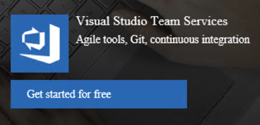

3.  Authenticate with a Microsoft account.

4.  Choose a name for your visualstudio.com account. For the purposes of this scenario, we will use "TailspinToys." Choose **Git** for the source code and then click Create.
    
    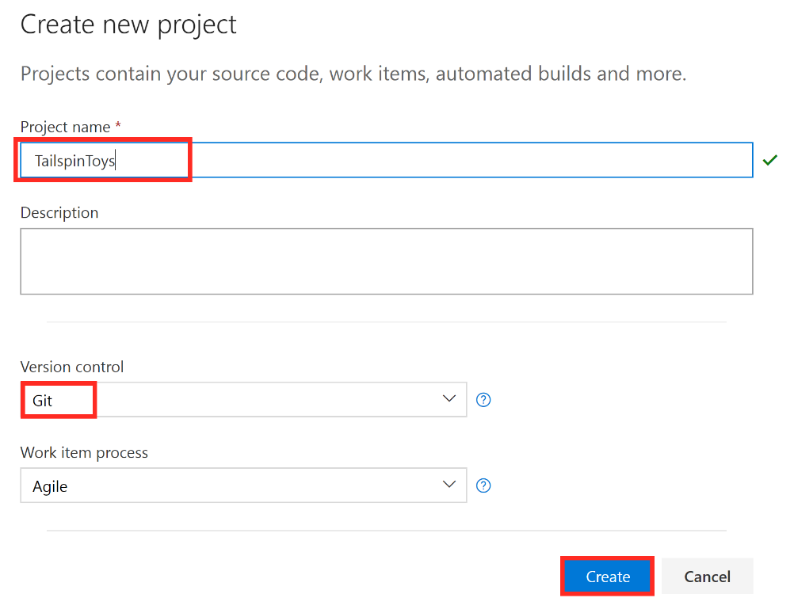

5.  Once the Project is created, click on the **Code** menu option in the header navigation.

    

6.  On the **Code** -\> **File** page for the **TailspinToys** repository, scroll down to the bottom of the page, then click on the **Initialize** button to get the "master" branch created.
    
    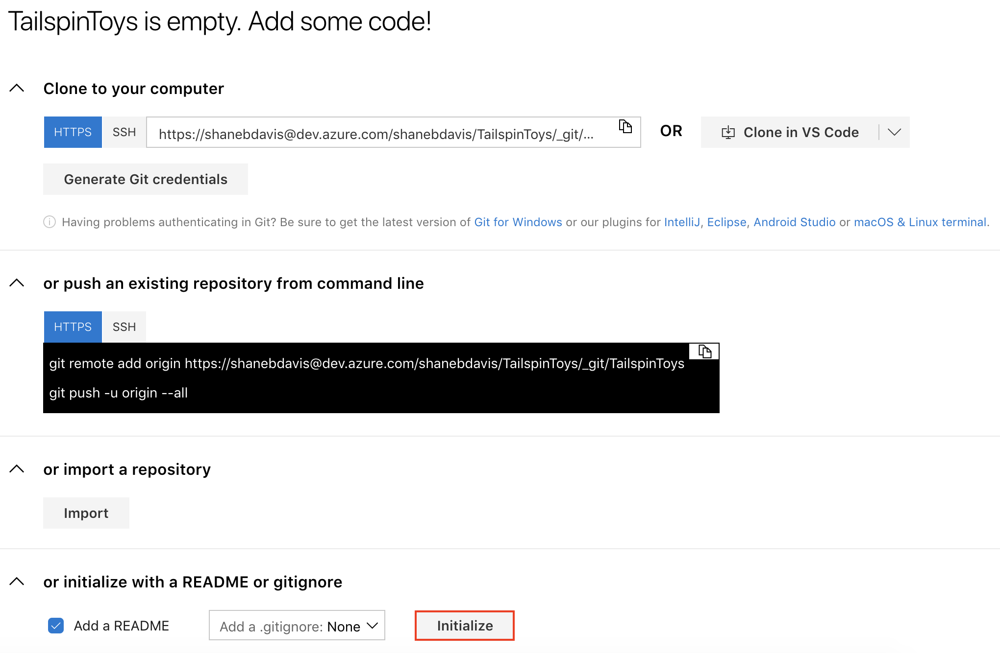

### Task 2: Add the Tailspin Toys source code repository to Azure DevOps

In this Task, you will configure the Azure DevOps Git repository. You will configure the remote repository using Git and then push the source code up to Azure DevOps through the command line tools.

1.  In the support files, open a command prompt in the **C:\\Hackathon** folder.

    > **Note**: If this folder doesn't exist ensure you followed the instructions in the Before the HOL.

2.  Initialize a local Git repository by running the following commands at the command prompt:

    ```
    git init
    git add *
    git commit -m "adding files"
    ```
    
    >If a ".git" folder and local repository already exists in the TailspinToys.Web folder, then you will need to delete the ."git" folder first before running the above commands to initialize the Git repository.

3.  Leave that command prompt window open and switch back to the web browser window for Azure DevOps from the previous Task.

4.  Within the list of Branches, click on the **master** branch name.
    
    

5.  Click on the **Clone** link in the upper-right.
    
    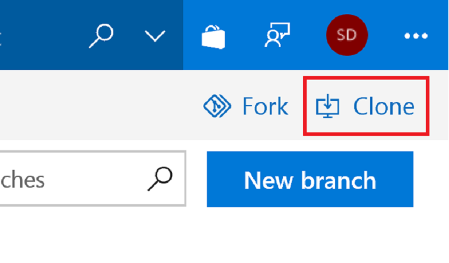

6.  Copy the **HTTPS** URL for the Git repository for use in the following step.

    

7.  Go back to the **Command Prompt** and run the following command with including the HTTPS URL for your Git repository.

    ```
    git remote add origin https://<azure devops account name>.visualstudio.com/_git/TailspinToys
    ```

8.  Next, run the following command:

    ```
    git push -u origin --all
    ```

9.  When prompted, login with your Microsoft Account for your Azure DevOps Account.
    
    

10. You will get an error message similar to the following since the local repository was created before the clone of the Azure DevOps Git repository:
    
    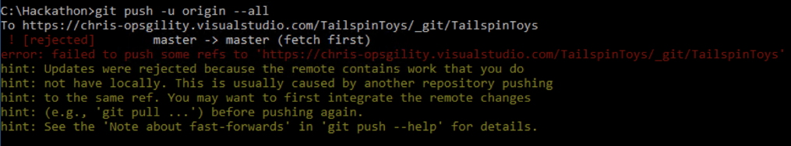

11. To fix this error, you will need to pull down the latest from the Azure DevOps Git repository and force it to merge even though the histories do not match. You can do this by running the following command:

    ```
    git pull origin master --allow-unrelated-histories
    ```

12. Now run the "git push" command again.

    ```
    git push -u origin --all
    ```

13. Once the local changes are pushed up to the Azure DevOps Git repository, you should see command-line output similar to the following:

    

14. Go back to the web browser window for Azure DevOps and click on the **Files** link.
    
    

15. You should see your source code now appearing inside of Visual Studio Team Services.
    
    

## Exercise 3: Create Azure DevOps build definition

Duration: 15 Minutes

In this exercise, you will create a build definition in Azure DevOps that automatically builds the web application with every commit of source code. This will lay the groundwork for us to then create a release pipeline for publishing the code to our Azure environments.

### Task 1: Create a build definition

1.  Select the Build and Release hub in your Azure DevOps project, and then select the Builds link.

    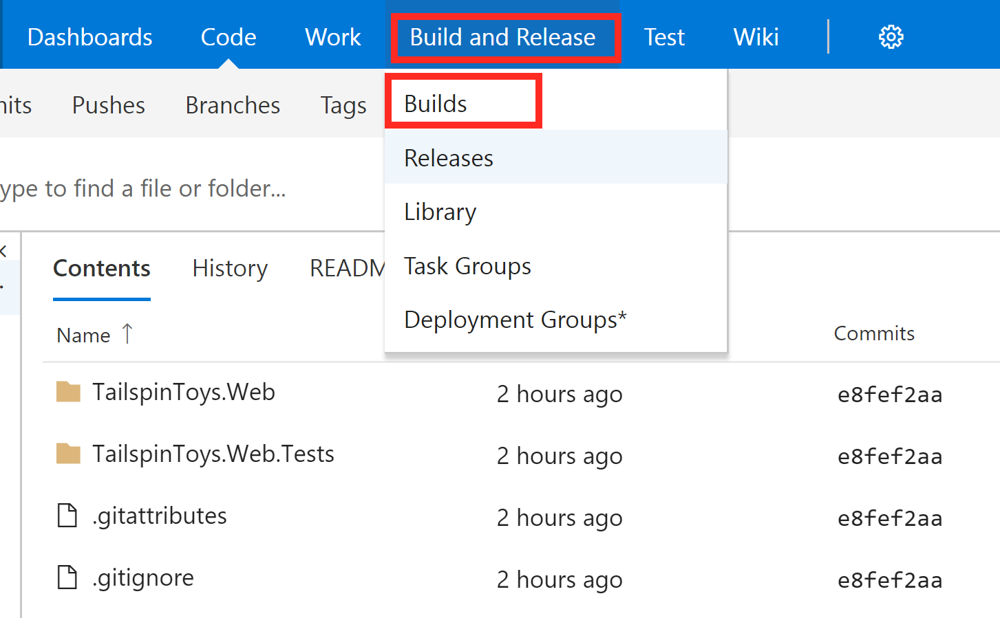

2.  Create a new pipeline and click continue on the following selection screen below.

    

    

3.  Select the "Empty job" link.

    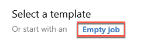

4.  Then, you are presented with the build definition process editor. Because we selected "Empty job" in the previous step, this process template comes is pretty empty at the moment. This is where we will add and configure Tasks that define our build process. Notice the Name field on the right side of the screen is already filled in for us with "TailspinToys-CI." You can change this name for your builds, but for now, we will leave it as is.

    

5.  Use the dropdown menu to set Agent pool to "Hosted." This tells Azure DevOps that you want to use their provided build server to build your application. Very convenient.

    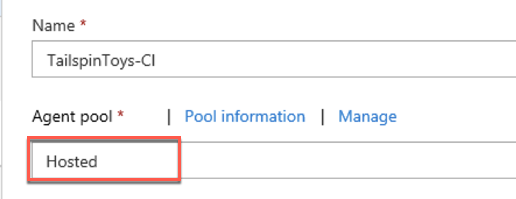

6.  On the left side of the screen, select the "Get sources" task. Notice the configuration options that appear on the right side of the screen. This is a consistent experience when navigating through the task list. This task is already configured to point to our "TailspinToys" repository and master branch that we configured earlier. No changes are needed to this task.

    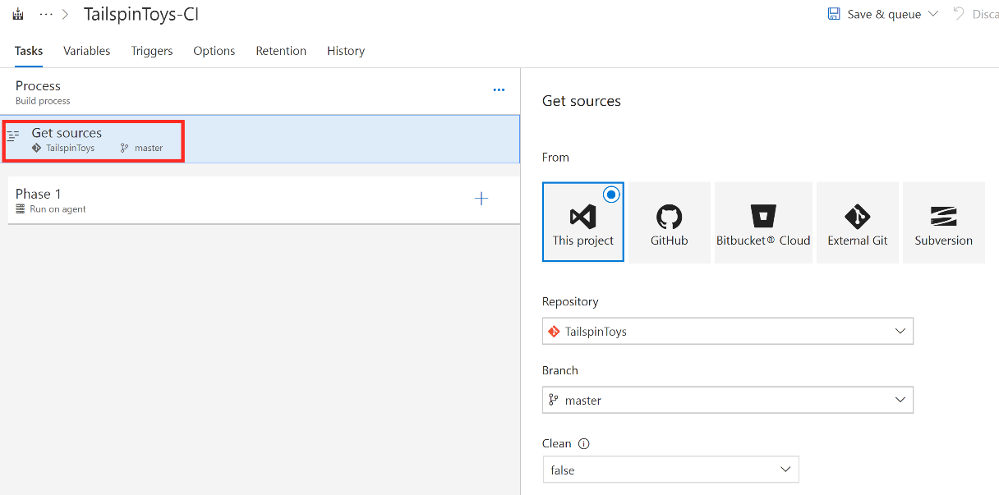

7.  Next, it is time to add the tasks the perform the build process. Note the default "Agent job 1" section on the left side of the screen. This section will hold all of the upcoming tasks we add for our build process. It is simply a way of logically grouping tasks. You can change the display name of "Agent job 1", but we will leave it as is for this scenario. Click on the "+" plus sign to the right of the "Agent job 1" section header. This will bring up the Add tasks list on the right.

    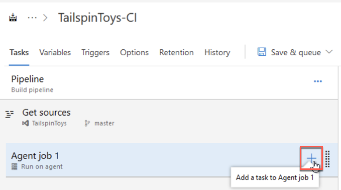

8.  We will add four new tasks. In the Search box in the top right of the Add tasks screen, type "Nuget" to filter down the list. Several will be listed and your list may differ slightly from the list below. Select the "NuGet" task and click the "Add" button. 

    

9.  This adds a new item to the Agent job 1 list on the left side of the screen labeled "NuGet restore." Next, we will add the task for actually building the solution. Replace the "Nuget" text in the search box with "Visual Studio Build" and select the Visual Studio Build task by clicking the "Add" button.

    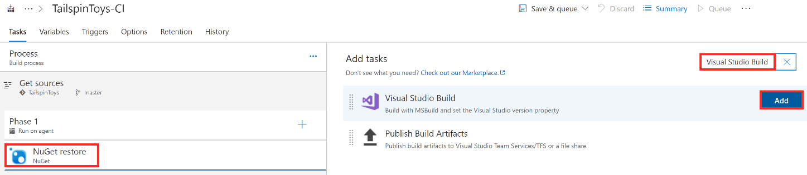

10. This also added a new item to Agent job 1 list on the left side of the screen labeled "Build solution \*\*\\\*.sln." Next, add the task for executing unit tests. Replace the "Visual Studio Build" text in the search box with "Visual Studio Test" and select the task by clicking the "Add" button.

    

11. The last task you add will be to package up the build and prepare it for deployment. Replace the "Visual Studio Test" text in the search box with "Publish Build Artifacts" and select the task by clicking the "Add" button.

    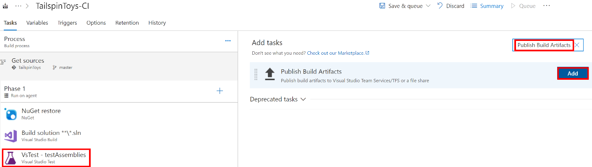

12. Now that we have added the final task, we will need to go back and configure several of the tasks.

13. Select the "Build solution \*\*\\\*.sln" task that you added copy the following text into the "MSBuild Arguments" field as shown in the screen shot below:

    ```
    /p:DeployOnBuild=true /p:WebPublishMethod=Package /p:PackageAsSingleFile=true /p:SkipInvalidConfigurations=true /p:PackageLocation="$(build.artifactstagingdirectory)\\"
    ```

    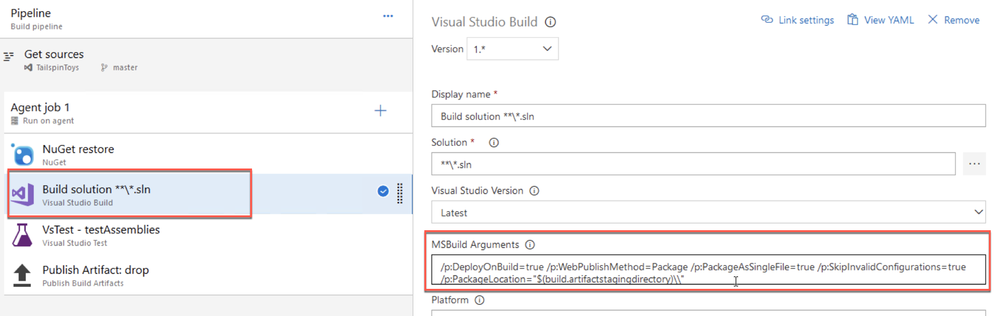

14. Select the "Publish Artifact" task that you added and enter "\$(Build.ArtifactStagingDirectory)" into the Path to publish field and enter "TailspinToys-CI" into the Artifact name field as shown in the screen shot below:

    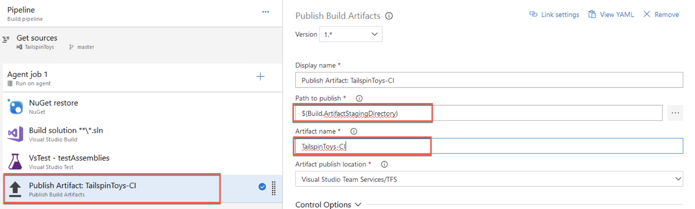

15. As a last step, select the dropdown arrow next to the "Save & queue" button near the top of the screen. You will be asked to confirm the save request. Just click "Save" again.

    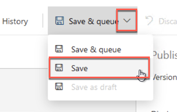

16. Congratulations! You have just created your first build definition. In the next exercise, we will create a release pipeline that deploys your builds.

### Task 2: Enable continuous integration

1.  For this scenario, we want the build definition to automatically trigger a build when any code is committed to the master repository. This is known as continuous integration. To configure a build definition for continuous integration, select the "Triggers" menu item and check the "Enable continuous integration" option. Be sure to set the Branch filters fields to match the screen shot below.

    

2.  Save the changes.

## Exercise 4: Create Azure DevOps release pipeline

Duration: 30 Minutes

In this exercise, you will create a release pipeline in Azure DevOps that performs automated deployment of build artifacts to Microsoft Azure. The release pipeline will deploy to three environments: dev, test, and production.

### Task 1: Create a release definition

1.  Navigate to the "Build and Release" hub and select "Releases" from the menu. This will bring up the Release Management screen. Click on the "+ New definition" button to begin the creation of a new release definition.

    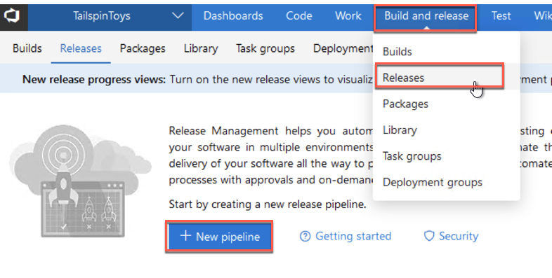

2.  You are then presented with several release templates to choose from. Click the "Empty job" link at the top of the screen.

    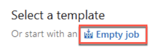

3.  This will present you with the Release Management editor which allows you to manage your release environments. Let us start by giving this release definition a name. Change the value "New Release Definition" at the top of the editor to "TailspinToys-Release" by clicking on name to begin editing.

4.  Then, let us name our first environment by changing the Environment name field from "Environment 1" to "dev." In a future step, we will add additional environments.

    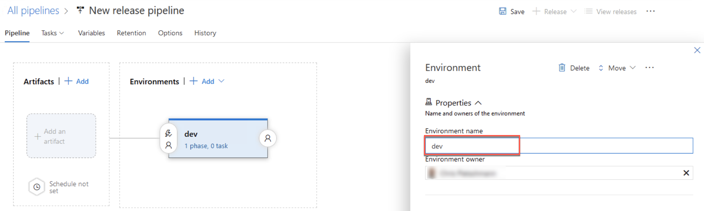

5.  In this step, we will connect the artifacts from our build definition to this newly created release definition. Click on the "+ Add" button or the "+ Add artifact" icon on the left side of the screen to begin this process.

    

6.  The Add artifact screen will display and many of the fields will already be populated. In the Source (Build definition) field select the "TailspinToys-CI" build definition you created in a previous exercise and then click the "Add" button.

    

7.  Now, it is time to begin adding specific tasks to perform a deployment to the dev environment. To navigate to the task editor, click on the "Task" menu drop down and then click the "dev" environment.

    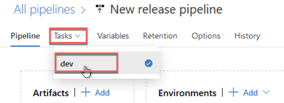

8.  This brings up the task editor. This interface will be familiar to you as it is very similar to the task editor you used when creating the build definition. For this release definition we will need to add two tasks.

9.  Click on the "+" button to bring up the Add tasks window.

10. Enter "Azure App Service" into the search box.

11. Select Azure App Services Deploy, and then click the "Add" button.

    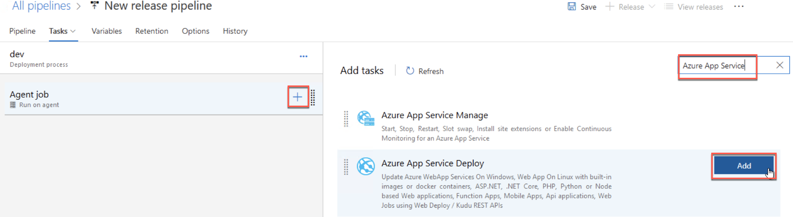

12. We also need to add the second task on that search list "Azure App Service Manage." This task will assist us with the deployment slot swap after deployment. Click the "Add" button next to that task to also add it.

    

13. Both tasks need some configuration before they will work. On the left side of the screen, click on the Azure App Service Deploy task to bring up the configuration window. At the start of this task, your list of fields may not look the same as the screen shot below, but the display will change as you begin to configure the fields from top to bottom.

14. In the Azure subscription field, select your subscription. You may see an "Authorize" button which will require you to authentication to Azure before populating this drop-down list.

15. In the App Service name field, select the item that begins with "TailspinToysWeb-dev." There will be series of numbers and letters after which will not match the screen shot below. This is due to the uniqueness requirement of resource names.

16. Check the Deploy to slot checkbox.

17. Select "TailspinToys-dev" from the Resource group drop down list.

18. Finally, select the "staging" value from the Slot drop down list. This tells the deployment to deploy to the slot first.

    

19. Scroll down the configuration screen to see additional configuration fields.

20. In the Package or folder option enter the following text:
    
    ```
    $(System.DefaultWorkingDirectory)/**/*.zip
    ```
    
    

21. That completes the configuration for the Azure App Service Deploy task. Now, select the Swap Slots task to bring up the configuration screen.

22. In the Azure subscription field, select your subscription. You may see an "Authorize" button which will require you to authentication to Azure before populating this drop-down list.

23. In the App Service name field, select the item that begins with "TailspinToysWeb-dev." There will be series of numbers and letters after which will not match the screen shot below. This is due to the uniqueness requirement of resource names.

24. Select "TailspinToys-dev" from the Resource group drop down list.

25. Finally, select the "staging" value from the Source Slot drop down list. This tells the deployment to swap the staging slot with production.

    

26. Click the "Save" button at the top of the screen and confirm by clicking the "OK" button.

27. Congratulations! You have just created your first release pipeline.

### Task 2: Add test and production environments to release definition

1.  Navigate to the "Releases" menu and click "..." next to the TailspinToys-Release definition. Then, click "Edit" to bring up the Release Management editor.

    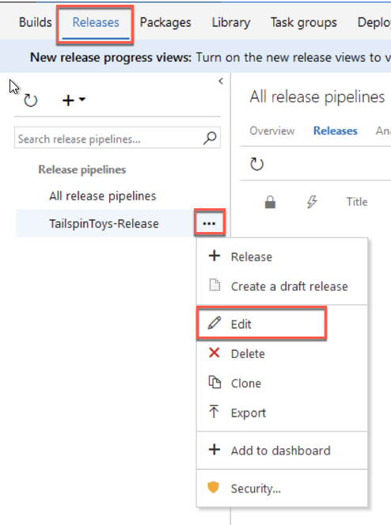

2.  Move your mouse over the dev environment and a click the "Clone" button to create a copy of the deployment tasks from the dev environment. We will use these same steps to deploy to test with a few configuration changes.

    

3.  Click on the new environment "Copy of dev" to bring up the configuration screen.

4.  Change the Environment name to "test".

5.  Now, we will begin editing the configuration for the test environment. Click the "1 phase, 2 tasks" link for the test environment.

    

6.  Select the "Azure App Service Deploy" task to bring up the task configuration panel. Notice the settings are the same as when we configured it for the dev environment because we cloned the dev environment to create the test environment.

7.  For the App Service name field, select the item that begins with "TailspinToysWeb-test".

8.  For the Resource group field, select "TailspinToys-test".

9.  For the Slot field, select "staging".

    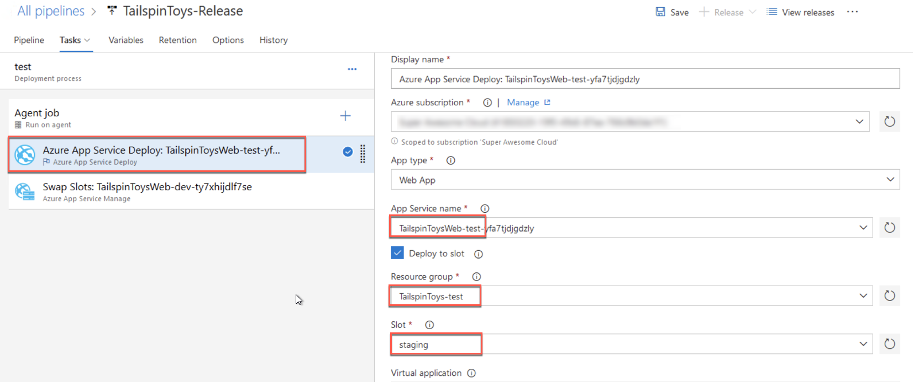

10. We have completed configuration of the first task. Now, select the "Swap Slots" task to bring up the configuration panel.

11. For the App Service name field, select the item that begins with "TailspinToysWeb-test".

12. For the Resource group field, select "TailspinToys-test".

13. For the Source Slot field, select "staging".

    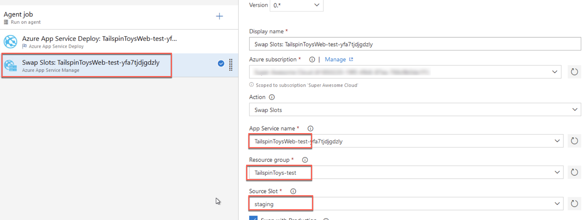

14. Click the "Save" button at the top of the screen, and confirm by clicking the "OK" button.

15. Congratulations! You have just created a test environment and added it to your pipeline.

16. Repeat all of the steps in Task 2 to create a production environment being careful to enter "production" as a replacement for "test" and selecting "TailspinWeb-production" instead of "TailspinWeb-test" where applicable. Do not forget to configure to individual steps in the newly cloned production environment.

17. The final release pipeline should look like the screen shot below:

    

18. Now you will enable the continuous deployment trigger so the release process automatically begins as soon as a build successfully completes. To do this, click on the lightning bolt icon in the Artifacts window.

19. This will bring up the Continuous deployment trigger panel. Change the setting to "Enabled".

    

20. Click Save, and confirm your changes.

21. Congratulations! You have completed the creation of a release pipeline with three environments.

## Exercise 5: Trigger a build and release

Duration: 10 Minutes

In this exercise, you will trigger an automated build and release of the web application using the build definition and release pipeline you created in earlier exercises. The release pipeline will deploy to three environments: dev, test, and production.

Any commit of new or modified code to the master branch will automatically trigger a build. The task below is for when you want to manually trigger a build without a code change.

### Task 1: Manually queue a new build and follow it through the release pipeline

1.  Navigate to the "Builds" menu and click "..." next to the TailspinToys-CI build definition. Then, select "Queue new build..." menu option.

    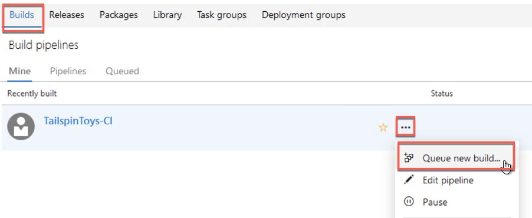

2.  This will present a popup titled "Queue build for TailspinToys-CI." Click the "Queue" button at the bottom of the popup.

    

3. Click the **Build number** next to the name of the Build pipeline to view the status of the build.

    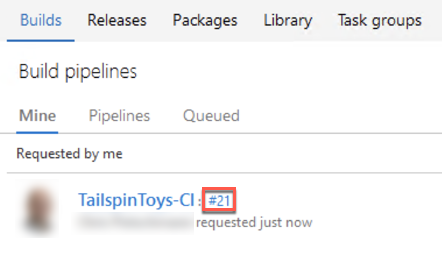

4.  If the build is successful, it will resemble the screen shot below:

    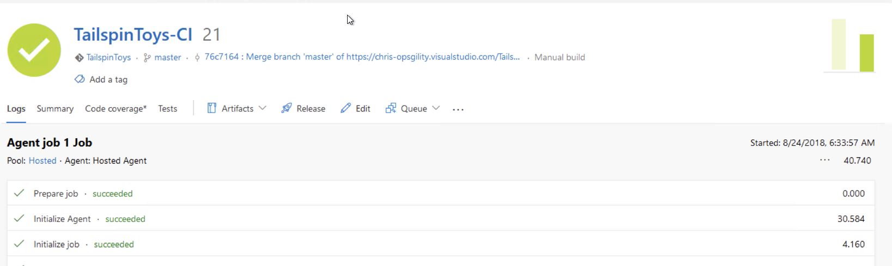

5.  Because we configured continuous deployment, the deployment to dev environment will then be triggered immediately. It will continue through on to the test and production environments. A successful release through all three environments will look like the screen shot below.

    

## Exercise 6: Create a feature branch and submit a pull request

Duration: 20 Minutes

In this exercise, you will create a short-lived feature branch, make a small code change, commit the code, and submit a pull request. You'll then merge the pull request into the master branch which triggers an automated build and release of the application.

In the tasks below, you will make changes directly through the Azure DevOps web interface. These steps could also be performed through the Visual Studio IDE.

### Task 1: Create a new branch

1.  Select the "Code" hub. Then, select "Branches".

    

2.  Click the "New branch" button in the upper right corner of the page.

3.  In the "Create a branch" dialog, enter a name for the new branch. In this scenario, name it "new-heading". In the "Based on" field, be sure master is selected.

    

4.  Click "Create branch".

### Task 2: Make a code change to the feature branch

1.  Click on the name of the newly created branch. This will present the "Files" window.

    

2.  Next, you'll make a change to a page in the web application in the web browser.

3.  Click on the "TailspinToys.Web" folder.

4.  Then, click on the "Views" folder.

5.  Then, click on the "Home" folder.

6.  Locate and click on the "Index.cshtml" file. You will now see the contents of the file.

7.  Click on the "Edit" button on the top right of the screen to begin editing the page.

    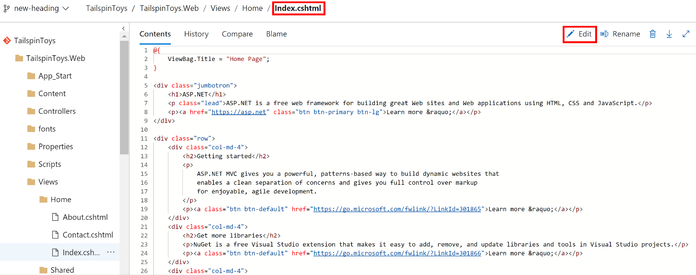

8.  Replace the code on line 6 with the following:

    ```
    <h1>Tailspin Toys</h1>
    ```
    
9.  Now that you've completed the code change, click on the "Commit..." button on the top right side of the screen.

    

10. This will present the Commit popup where you can enter a comment. Click the "Commit" button.

    

### Task 3: Submit a pull request

1.  Select the "Branches" menu. Then, select the "..." button next to the branch you created earlier. Then, click on the "New pull request" option.

    

2.  This brings up the New Pull Request page. It shows we are submitting a request to merge code from our new-heading branch into the master branch. You have the option to change the Title and Description fields. The TailspinToys Team has been selected to review this pull request before it will be merged. The details of the code change are at the bottom of the page.

    

3.  Click the "Create" button to submit the pull request.

### Task 4: Approve and complete a pull request

Typically, the next few steps would be performed by another team member. This would allow for the code to be peer reviewed. However, in this scenario, you will continue as if you are the only developer on the project.

1.  After submitting the pull request, you are presented with Pull Requests review screen.

2.  First, click the "Approve" button assuming you approve of the code that was modified.

3.  This will note that you approved the pull request. Then, click the "Complete" button to finish and merge the pull request into the master branch.

    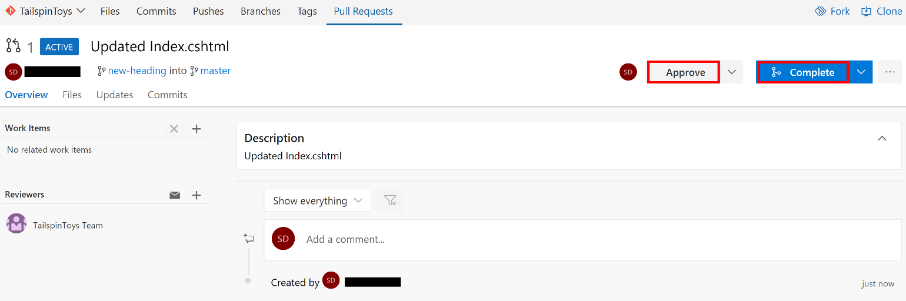

4.  After clicking the Complete button in the previous step, you will be presented with the Complete pull request popup. You can add additional comments for the merge activity. By selecting the "Delete new-heading after merging" option, our branch will be deleted after the merge has been completed. This keeps our repository clean of old and abandoned branches and eliminates the possibility of confusion.

    

5.  Click the "Complete merge" button.

6.  You will then see a confirmation of the completed pull request.

    

7.  Congratulations! You just created a branch, made a code change, submitted a pull request, approved the pull request, and merged the code.

8.  Because we configured continuous integration and continuous deployment, an automated build will be triggered and deployment to dev environment will then begin immediately after a successful build. It will continue through on to the test and production environments.

## After the hands-on lab

Duration: 10 Minutes

These steps should be followed only *after* completing the hands-on lab.

### Task 1: Delete resources

1.  Now since the hands-on lab is complete, go ahead and delete all of the Resource Groups that were created for this hands-on lab. You will no longer need those resources and it will be beneficial to clean up your Azure Subscription.
